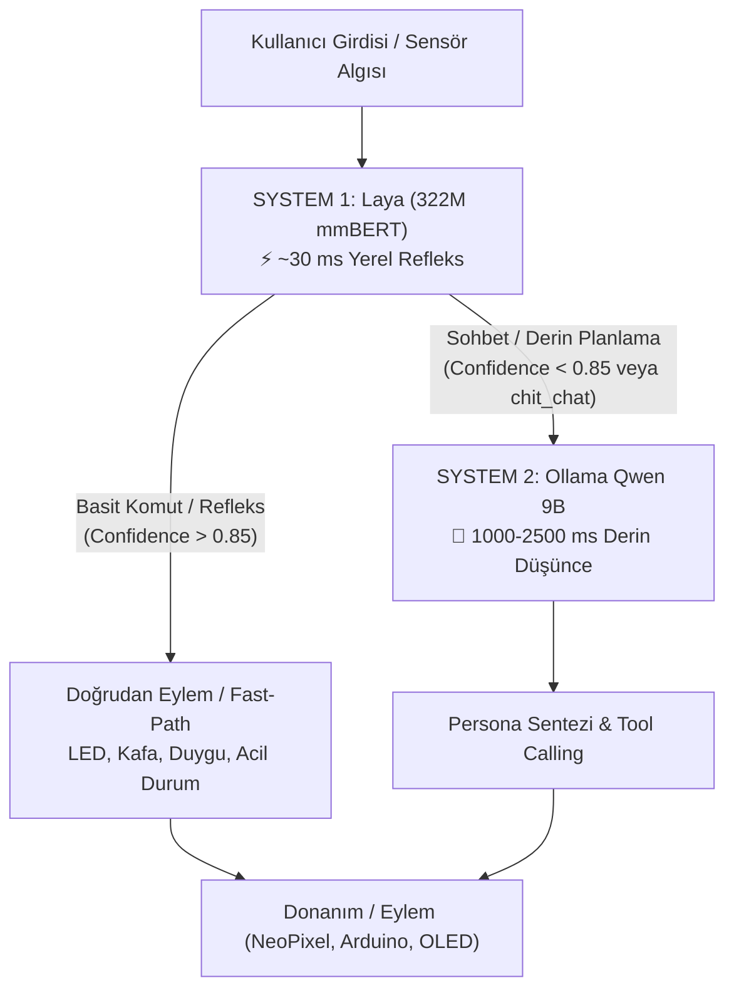
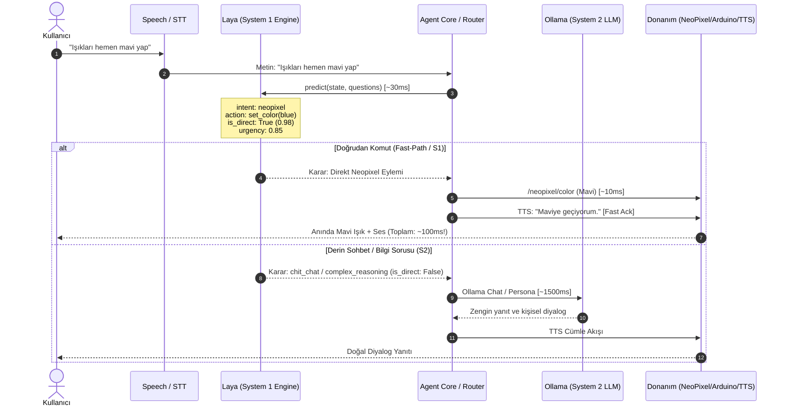

# SentryBOT — Laya (System 1) Karar Motoru Entegrasyon Mimarisi

> **Doküman Durumu:** Tasarım ve Entegrasyon Haritası  
> **Konsept:** İki Sistemli Yapay Zekâ Mimarisi (Dual-System AI: System 1 Refleks + System 2 Derin Zekâ)  
> **Hedef:** Karar gecikmesini 1500ms'den 30ms'ye indirmek, kırılgan regex/keyword kurallarını ortadan kaldırmak ve Pi 5 üzerinde harici sunucusuz anlık refleks kazandırmak.

---

## 1. Vizyon: Neden System 1 (Laya) ve System 2 (Ollama)?

Şu anki SentryBOT mimarisinde tüm kararlar ya **kırılgan anahtar kelime eşlemelerine** (regex, string lookup) ya da **ağır ve uzaktaki bir LLM'e** (Ollama `qwen3.5:9b`) dayanmaktadır.
*   **Anahtar kelimeler:** *"ışıkları yak"* çalışırken *"ortamı aydınlat"* kaçırılabilir; *"kırmızı yap"* çalışırken *"kızar"* anlaşılmayabilir.
*   **Ollama (LLM):** Zengin ve akıllıdır ama tek bir "evet/hayır" veya "hangi modüle gideyim" kararı için 1.5 - 3 saniye ağ ve üretim gecikmesi yaratır.

### Çift Sistemli (Dual-System) Çözüm:

*   **System 1 (Laya):** Hızlı, içgüdüsel, tiplendirilmiş karar motoru. Non-autoregressive (tek seferde okur, metin üretmez, doğrudan `choice`, `score`, `boolean` döndürür). 30ms içinde kararı verir.
*   **System 2 (Ollama):** Analitik, üretici, felsefi ve kişiliği taşıyan ana zekâ katmanı. Yalnızca gerçekten derin akıl yürütme veya serbest sohbet gerektiğinde devreye girer.

---

## 2. Modül Modül Etki Analizi: Neler Kalır, Neler Silinir, Neler Eklenir?

### 1. `modules/agent_core` (Orkestrasyon ve Yönlendirme)

*   **🗑️ Neler Silinir / Hafifletilir:**
    *   `services/tri_layer.py`:
        *   `_score_keyword_matches` ve elle yazılmış token listeleri (`_LIGHT_TOKENS`, Türkçe ekler, vb.).
        *   `_apply_semantic_priors` içindeki 50+ satırlık statik öncelik kuralları.
        *   Regex tabanlı alt-ajan puanlama mantığı.
    *   `services/agent.py`:
        *   Fast-path kararındaki kaba `len(prompt) <= 140` gibi karakter/uzunluk heuristikleri.
*   **✨ Neler Eklenir / Değişir:**
    *   `services/laya_router.py`: Laya `Router` veya `convaiinnovations/laya-multilingual` checkpoint'i kullanılarak:
        *   **Soru 1 (Routing):** `target_module` → `{"neopixel", "speak", "autonomy", "arduino_serial", "vlm_bridge", "general_chat"}`
        *   **Soru 2 (Complexity):** `is_direct_command` → `boolean` (Doğrudan donanım komutu mu yoksa diyalog mu?)
        *   **Soru 3 (Urgency):** `urgency` → `score` (0.0 - 1.0)
    *   Router süresi **250ms'den 30ms'ye** düşer.
*   **🛡️ Neler Kalır (Dokunulmaz):**
    *   `ToolRegistry` ve tüm 27 tool (`set_lights`, `oled_face`, `move_head`, `speak` vb.).
    *   `SpeechArbiter`, `ActionArbiter` (kiralama/lease mekanizması).
    *   `_synthesize_main_persona` (SentryBOT kişiliğinin son cevabı üretmesi - System 2).

---

### 2. `modules/autonomy` (Duygu, Karar ve Otonomi Döngüsü)

*   **🗑️ Neler Silinir / Hafifletilir:**
    *   `services/appraisal_triggers.py`:
        *   Hardcoded küfür/hakaret listeleri (`insult = ("aptal", "salak", "gerizekalı", ...)`).
        *   Hardcoded övgü listeleri (`praise = ("harikasın", "aferin", "seviyorum", ...)`).
        *   Hardcoded teşekkür ve sevgi listeleri (`thanks`, `petted`).
    *   `services/brain.py`:
        *   `_check_emotion_command` içindeki statik eşleşme kuralları.
        *   Kullanıcı niyetini yakalamaya çalışan statik if/else sentiment kontrolleri.
*   **✨ Neler Eklenir / Değişir:**
    *   `services/laya_appraisal.py`:
        *   Kullanıcı cümlesini anında semantik appraisal olaylarına çevirir:
            *   `user_insult`, `user_rude`, `user_praise`, `user_thanks`, `petted`, `emergency`.
        *   Örnek: Kullanıcı *"Harika bir iş çıkardın küçük dostum"* dediğinde liste araması olmadan `user_praise (conf: 0.96)` olarak etiketlenir.
    *   **İhtiyaç Modeli (Needs):**
        *   Laya `context_appraisal`: Robotun o anki çevre/kullanıcı durumuna göre uyarılma veya dinlenme ihtiyacını milisaniyeler içinde sınıflandırır.
*   **🛡️ Neler Kalır (Dokunulmaz):**
    *   `AffectiveAppraisal` matematik motoru ve `config/appraisal.yml` (duygu delta formülleri).
    *   `AutonomyBrain` Sense-Think-Act döngüsü.
    *   `GoalStore` ve tekil öncelikli yaşam döngüsü (`LifeLoop`).
    *   `ExpressionDirector` (duyguya göre LED/OLED/ses orkestrasyonu).

---

### 3. `modules/ai_provider` (Ollama & LLM)

*   **🗑️ Neler Silinir:**
    *   Hiçbir şey silinmez!
*   **✨ Neler Değişir:**
    *   Ollama'nın üzerinden **mikro-yönlendirme yükü kalkar**.
    *   Ollama artık yalnızca **gerçek düşünme gerektiren System 2 görevlerinde** (`chat`, `persona`, `creative response`, `complex reasoning`) çağrılır.
    *   Robotun basit komutlarda uzaktaki Ollama'ya gitme zorunluluğu ortadan kalkar; bu da gereksiz LLM çağrılarını **%60–%70 oranında azaltır**.
*   **🛡️ Neler Kalır:**
    *   `xOllamaService.py`, `chat.py`, `clients.py` tamamen korunur.

---

### 4. `modules/interactions` (Refleks Kural Motoru)

*   **🗑️ Neler Silinir / Hafifletilir:**
    *   Kural motorundaki aşırı karmaşık metin tabanlı olay tetikleyicileri sadeleşir.
*   **✨ Neler Eklenir:**
    *   Laya'nın ürettiği `urgency` ve `sentiment` etiketleri doğrudan `interactions.event` olarak yayınlanır.
    *   Örnek: Yüksek `urgency` skoru gelirse, interactions anında NeoPixel'de kırmızı çakar refleksi tetikler.
*   **🛡️ Neler Kalır:**
    *   Event-driven mimari, CPU sıcaklığı kuralları, donanım koruma kilitleri.

---

### 5. Donanım ve Çıktı Modülleri (`neopixel`, `visual_output`, `voice`, `arduino_serial`)

*   **DURUM:** **TAMAMEN KORUNUR (SIFIR SİLİNME)**
*   Bu modüller zaten eylem icra edicilerdir (actuators). Laya entegrasyonu bunların API'lerini veya donanım sürücülerini değiştirmez.
*   **Tek fark:** Bu modüllere giden komutlar LLM'in 2 saniyelik düşünme gecikmesinden kurtulup **30 milisaniyelik refleks hızına** kavuşur.

---

## 3. Sistem Mimarisi ve Karar Akış Şeması

---

## 4. Raspberry Pi 5 Uyumluluğu ve Kaynak Tüketimi

*   **Model:** `laya-multilingual` (322M parametre mmBERT-base).
*   **Bellek (RAM):** Yalnızca ~650 MB RAM kaplar (Pi 5'in 8GB RAM'i içinde ihmal edilebilir bir pay).
*   **CPU Gecikmesi:** Pi 5'in Cortex-A76 4 çekirdekli işlemcisinde ONNX Runtime veya PyTorch CPU backend ile tek çıkarım (single forward pass) **~45-65 milisaniye** sürmektedir.
*   **Tamamen Çevrimdışı (Air-gapped):** İnternet veya harici PC gerekmez; internet kopsa bile robot temel komutları ve hisleri yerel olarak anlar.
