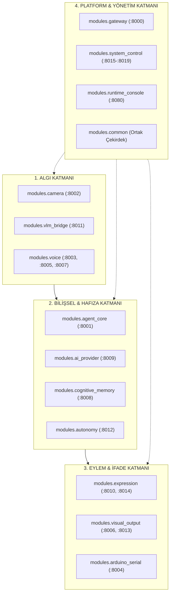
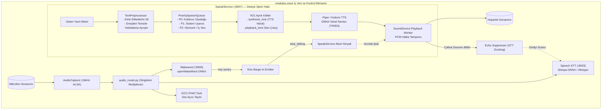
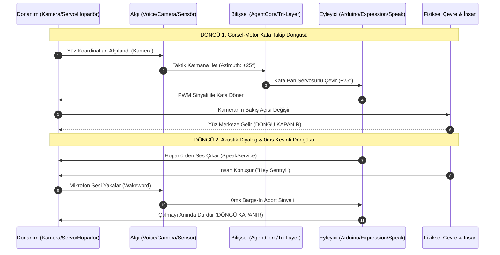

# SentryBOT V5 — Birleşik Master Sistem Mimarisi & Kapalı Döngü Boru Hattı

> **Doküman Versiyonu:** 5.0.0 (Nihai)  
> **Tarih:** 4 Ekim 2026  
> **Yazar:** Kıdemli Teknik Dokümantasyon Uzmanı & Yazılım Mimarı  
> **Kapsam:** 14 Otonom Mikroservis, Donanım HAL, Bilişsel Katmanlar ve 7 Kapalı Geri Besleme Döngüsü  
> **Görsel Mimari Şemaları:**  
> - 🇹🇷 **Türkçe Vektörel Şema:** [docs/master_pipeline_tr.svg](file:///c:/Users/emohi/Desktop/Project SentryBOT V5/docs/master_pipeline_tr.svg) ([Kaynak .dot](file:///c:/Users/emohi/Desktop/Project SentryBOT V5/docs/master_pipeline_tr.dot))  
> - 🌐 **İngilizce Vektörel Şema:** [docs/master_pipeline.svg](file:///c:/Users/emohi/Desktop/Project SentryBOT V5/docs/master_pipeline.svg) ([Kaynak .dot](file:///c:/Users/emohi/Desktop/Project SentryBOT V5/docs/master_pipeline.dot))

---

## 1. Giriş ve Kibernetik Mimari Felsefesi

Klasik robotik tasarımlarda sistemler genellikle **açık uçlu (open-loop)** bir mantıkla modellenir: Sensörden veri okunur, karar verilir ve eyleyiciye (motora/hoparlöre) komut gönderilip süreç orada sonlandırılır. 

**Project SentryBOT V5**, modern sibernetik ve bilişsel otonom robotik prensipleri üzerine inşa edilmiştir. Sistemdeki hiçbir eylem havada asılı kalmaz veya tek yönlü bir komut olarak bırakılmaz. Her algısal girdi, bilişsel muhakeme katmanından geçerek fiziksel dünyada (mekanik hareket, ışık dalgası veya akustik ses) bir etki yaratır; bu fiziksel etki de anında sensörler (kamera, mikrofon, ultrasonik sensör, telemetri) tarafından yeniden algılanarak **DÖNGÜYÜ TAMAMEN KAPATIR (Closed-Loop System)**.

Bu doküman, SentryBOT V5'in bünyesindeki **14 mikroservisin tüm iç alt bileşenlerini**, iş parçacıklarını, kuyruklarını, kilitlerini ve bu servislerin oluşturduğu **7 ana kapalı geri besleme döngüsünü** en ince ayrıntısına kadar açıklamaktadır.

---

## 2. 14 Modülün Ayrıntılı İç Yapısı ve Bileşen Mimarisi

Sistemde yer alan 14 modülün her biri bağımsız bir mikroservis veya paylaşılan çekirdek kütüphane olarak çalışır. Aşağıda hiçbir bileşen yüzeysel bırakılmadan, iç servisleri ve mekanizmalarıyla listelenmiştir:

---

### Modül 1: `modules/common` — Ortak Çekirdek Kütüphaneleri
Sistemin tüm modülleri tarafından paylaşılan temel sözleşmeleri ve altyapı araçlarını barındırır.
- **`EventBus` (`event_bus.py`)**: Bellek içi ve süreçler arası asenkron yayınla/abone ol (Pub/Sub) veri yolu. Tip güvenli olay dağıtımı sağlar.
- **`ConfigLoader` (`config_loader.py`)**: `config/agent.yaml` dosyasını tek gerçeklik kaynağı (Single Source of Truth) olarak yükler; ortam değişkenleri (ENV) ile ezme desteği sunar.
- **`ServiceBase` (`service_base.py`)**: Tüm mikroservislerin türediği temel sınıf. Standart `/healthz` uç noktalarını, FastAPI yaşam döngüsünü ve zarif kapanma (graceful shutdown) protokollerini yönetir.
- **`ModelPolicy` (`model_policy.py`)**: Yerel (Ollama) ve bulut (Gemini) modelleri arasındaki yönlendirme, maliyet ve yedekleme politikalarını belirler.
- **`Persistence` (`persistence.py`)**: Güvenli SQLite bağlantı yönetimi, WAL modu optimizasyonu ve şema göç denetimleri.

---

### Modül 2: `modules/cognitive_memory` (Port: 8008) — Epizodik ve Sosyal Hafıza
Robotun zaman içindeki yaşantısını, tanıştığı insanları ve öğrendiği anlamsal bilgileri saklar.
- **`SQLiteStore` (`db.py` / `memory.sqlite3`)**: ACID garantili ilişkisel yerel veri tabanı.
- **`EpisodicMemory` (`services/episodic_memory.py`)**: Kullanıcı diyalog geçmişini, olayları, robotun otonom düşüncelerini ve zamanla sönen (time-decayed) anı ağırlıklarını yönetir.
- **`RelationshipMemory` (`services/relationship_memory.py`)**: Kullanıcı profillerini, arkadaşlık puanını, son etkileşim tarihini ve RFID kart UID eşlemelerini depolar.
- **`SemanticVectorIndex`**: Vektörel gömmeler (embeddings) üzerinden anlamsal RAG (Retrieval-Augmented Generation) araması yapar.

---

### Modül 3: `modules/camera` (Port: 8002) — Düşük Gecikmeli Görsel Yakalama
Fiziksel kameradan görüntüleri yakalar, işler ve diğer modüllere dağıtır.
- **`DeviceManager` (`device_manager.py`)**: Linux V4L2 aygıtlarını (`/dev/video0`, `/dev/video1`) otomatik tespit eder, libcamera ve USB kamera fallback mekanizmalarını yönetir.
- **`FrameCaptureWorker` (`xCameraService.py`)**: Arka planda sürekli çalışan iş parçacıklı kare yakalama döngüsü. FPS düşüşlerini önlemek için tamponları sürekli yeniler.
- **`JPEGStreamer` (`api/router.py`)**: `/video_feed` üzerinden MJPEG HTTP çoklu yayın (multicast) sağlar; Gateway ve Konsol aynı anda tek kameradan kare çekebilir.
- **`MotionDetector`**: Ardışık kareler arasındaki kontur farklarını hesaplayarak görsel hareket algılandığında sistemin uyanmasını sağlar.

---

### Modül 4: `modules/vlm_bridge` (Port: 8011) — Çok Modlu Görme Köprüsü
Kameradan gelen pikselleri yüksek seviyeli anlamsal kavramlara dönüştürür.
- **`VisionEventBus` (`services/vision_event_bus.py`)**: Diğer modüllerden gelen görsel analiz isteklerini kuyruklar.
- **`ProcessorVLM` (`services/processor_vlm.py`)**: Kareleri VLM çözünürlüğüne göre ölçeklendirir, token bütçesini kontrol eder ve prompt ile birleştirir.
- **`VLMClientFactory` (`services/ollama_vlm_client.py` & `google_vlm_client.py`)**: Yerelde Qwen2.5-VL veya bulutta Gemini 2.5 Flash Vision modellerini çalıştırır.
- **`SceneDescriptor & Emotion`**: Sahnedeki insan varlığını, yüz duygusunu, tehlikeli objeleri ve uzamsal koordinatları metinsel JSON olarak çıkarır.

---

### Modül 5: `modules/voice` (Portlar: 8003, 8005, 8007) — Ses Alt Sistemi

Ses alt sistemi, Linux ortamında ALSA aygıt çakışmalarını önlemek ve insan seviyesinde akıcı bir diyalog kurmak için 4 ana katmandan oluşur:

#### SpeakService (:8007) İç İşleyiş Detayları:
1. **`TextPreprocessor`**: LLM tarafından üretilen `<think>...</think>` muhakeme bloklarını, Markdown formatlarını ve emojileri temizler. Cümleleri doğal konuşma duraklarına göre dilimler.
2. **`PrioritySpeechQueue`**:
   - **P0 (Kritik/Kullanıcı):** Kullanıcı doğrudan bir soru sorduğunda veya acil bir durumda üretilen konuşma.
   - **P1 (Reaktif/Sistem):** Donanım veya şebeke durum bildirimleri.
   - **P2 (Otonomi/İç Ses):** Robotun kendi kendine konuşması veya mırıldanması. P0 geldiğinde P2 anında durdurulur ve kuyruktan atılır!
3. **`R21 Ayrık Kilitler` (`synthesis_lock` vs `playback_lock`)**:
   - Nöral TTS sentezi işlemciyi yoğun kullandığından `synthesis_lock` ile korunur.
   - Hoparlöre PCM ses gönderme işlemi ise `playback_lock` ile korunur.
   - Bu sayede robot bir cümleyi hoparlörden seslendirirken, sıradaki cümlenin sentezi arka planda paralel olarak tamamlanabilir; konuşma duraksamadan akar.
4. **`Piper / Kokoro TTS Engine`**: Düşük gecikmeli yerel ONNX modelleriyle Türkçe ve İngilizce insan benzeri fonetik ses sentezler.
5. **`SoundDevice Playback Worker`**: Ses kartına kesintisiz ses sağlayan asenkron akış iş parçacığı.
6. **`0ms Barge-In Abort (stop_talking)`**: Kullanıcı robot konuşurken söze girdiğinde, Wakeword servisi milisaniye mertebesinde `stop_talking()` metodunu tetikler; `sounddevice` akışı anında kesilir ve hoparlör susturulur.
7. **`Echo Suppressor & Ducking`**: Robot hoparlörden ses verirken, `audio_router` STT'ye giden mikrofon akışını baskılar (ducking); robotun kendi sesini kullanıcı zannedip transkribe etmesi kesin olarak engellenir.

---

### Modül 6: `modules/ai_provider` (Port: 8009) — Çoklu Sağlayıcı LLM Motoru
Bilişsel akıl yürütme motorlarının yönetildiği merkezdir.
- **`ClientFactory` (`services/clients.py`)**: Yerelde çalışan `ollama` (varsayılan: `qwen2.5:7b` veya `qwen3.5:9b`) ile buluttaki `Gemini 2.5 Flash` istemcilerini yönetir.
- **`PriorityInferenceLock`**: Konuşma diyaloğu taleplerine (P0) en yüksek önceliği verir; otonomi arka plan düşünceleri (P2) diyalog esnasında duraklatılır.
- **`TranslationBridge`**: İngilizce yeteneği daha güçlü küçük modeller için çift yönlü Türkçe <-> İngilizce anlık çeviri köprüsü sunar.
- **`FailoverMonitor`**: Yerel Ollama çökmesi veya zaman aşımında (timeout) 2 saniye içinde bulut modeline kesintisiz geçiş yapar.

---

### Modül 7: `modules/arduino_serial` (Port: 8004) — Donanım Soyutlama Katmanı (HAL)
Yüksek seviyeli yazılım dünyası ile mikrodenetleyici (MCU) arasındaki güvenli köprüdür.
- **`UART & ESP32 Transport` (`services/driver.py`)**: 115200 baud USB UART veya WiFi üzerinden ESP32 HTTP soket iletişimi.
- **`contract.py & CommandBuilder`**: Servolara rastgele açı gönderilmesini önler. Her komut `SERVO_BOUNDS` sınırlarına göre kırpılır (clamp) ve NDJSON formatında paketlenir.
- **`RX Worker Thread`**: Seri portu arka planda mikrosaniye hassasiyetinde okur; gelen ACK paketlerini eşleştirir ve sensör telemetrilerini ayrıştırır.
- **`RC522 Service`**: RFID kart okuyucuyu yönetir; donanımsal zıplamaları (debounce) filtreleyerek temiz UID olayları fırlatır.
- **`Sensors Telemetry Parser`**: Ultrasonik mesafe sensörü (HC-SR04), IMU açıları (MPU6050) ve batarya voltajını düzenli olarak ana sisteme iletir.

---

### Modül 8: `modules/visual_output` (Portlar: 8006, 8013) — Görsel İfade Donanımları
Robotun duygusal durumunu dış dünyaya yansıtan görsel aktüatörlerdir.
- **`FaceRenderer` (`oled_faces/` :8013)**: SSD1306 128x64 I2C OLED ekranda biyolojik göz ifadelerini çizer (Normal, Mutlu, Şaşkın, Kızgın, Uykulu). Doğal göz kırpma (blinking) ve rastgele odaklanma (saccade) algoritmalarına sahiptir.
- **`SubtitleRenderer`**: STT tarafından o anda tanınan kullanıcı metnini canlı altyazı olarak ekranın alt piksel satırında kaydırır.
- **`NeoRunner` (`neopixel/` :8006)**: WS2812B adreslenebilir RGB LED dizilerini yönetir. `wake_spin` (uyandığında dönen mavi ışık), `thinking_pulse` (düşünme mor nefes efekti) ve duygu aurası üretir.
- **`SegmentController`**: Kafa halkasındaki 16 LED ile göğüsteki durum LED'ini bağımsız olarak adresler.

---

### Modül 9: `modules/gateway` (Port: 8000) — Birleşik API Ağ Geçidi
Sistemin dış dünyaya ve kullanıcı arayüzlerine açılan tek merkezi giriş noktasıdır.
- **`ReverseProxy & Core` (`xGatewayService.py`)**: Tüm mikroservisleri arkasına alan yüksek performanslı FastAPI ters vekil sunucusu.
- **`ProcessSupervisor` (`services/bootstrap.py`)**: 14 modülün bağımlılık sırasına göre başlatılmasını ve çöken servislerin yeniden ayağa kaldırılmasını denetler.
- **`DynamicRouter` (`api/router.py`)**: Gelen `/api/v1/*` çağrılarını doğru alt modülün portuna yönlendirir.
- **`LegacyShims`**: Eski sürümlerle uyumluluk için `/speak`, `/transcribe`, `/actions` ve `/chat` köprülerini korur.

---

### Modül 10: `modules/agent_core` (Port: 8001) — Merkezi Ajan Beyni
Sistemin nihai karar vericisi ve bilişsel orkestratörüdür.
- **`Tri-Layer Decision Engine` (`agent_fast_path.py`)**:
  - **Katman 1: Refleks (<50ms):** Donanım sensörlerinden gelen acil engeller, düşme tehlikesi veya çarpma durumunda motorları doğrudan durduran refleks devresi.
  - **Katman 2: Taktik (50-300ms):** Yüze odaklanma, ses yönüne (DoA) kafa çevirme, OLED göz ifadesi ve LAYA sosyal dolgu üretimi.
  - **Katman 3: Stratejik (>300ms):** LLM muhakemesi, araç çağırma (Tool Calling), uzun süreli hafıza sorgulama ve planlama.
- **`LAYA Engine` (`services/laya_engine.py`)**: LLM düşünürken kullanıcının sessizlikten sıkılmaması için duruma uygun anlık Türkçe empatik dolgular üretir ("Hmm, bir saniye bakıyorum...").
- **`ActionArbiter & SpeechArbiter`**: Motor ve konuşma eylemleri arasında mutex kilidi sağlayarak iki farklı servisin aynı anda zıt yönlere komut vermesini engeller.
- **`SafetyFilter`**: Çıkış komutlarının hız ve açı sınırlarını denetler.
- **`HardwareTools`**: LLM'in `kamera_cek()`, `kafa_cevir()`, `isik_yak()` gibi araçları çağırmasını sağlayan arayüz.

---

### Modül 11: `modules/autonomy` (Port: 8012) — Otonom Yaşam ve Yoldaş Motoru
Robotun bir kullanıcı komutu olmadan da canlı gibi hissettirmesini sağlayan içsel motivasyon sistemidir.
- **`LifeEngine (Homeostatic Needs)`**: 4 temel biyolojik dürtüyü simüle eder: Enerji Seviyesi, Sosyal İhtiyaç, Merak ve Can Sıkıntısı (Boredom). Kullanıcı robotla konuşmadıkça can sıkıntısı lineer olarak artar.
- **`MoodEngine`**: 2 Boyutlu Değerlik / Uyarılma (Valence / Arousal) modeliyle robotun o anki neşesini veya durgunluğunu hesaplar.
- **`SaliencySelector`**: Kameradan gelen görsel konturlardan en çok dikkat çeken nesneyi seçerek robotun oraya odaklanmasını sağlar.
- **`CompanionEngine`**: Boşta kalındığında hafızadaki eski anılardan veya görsel çevreden yola çıkarak kendiliğinden meraklı sorular üretir.
- **`PatrolController`**: Güvenli rotalarda topolojik devriye gezisi planlar.

---

### Modül 12: `modules/expression` (Portlar: 8010, 8014) — Jest ve Koreografi Motoru
Robotun mekanik gövdesine duygu ve organik canlılık katan motordur.
- **`ExpressionDirector` (`xExpressionService.py`)**: Duygusal niyeti (örn. "heyecanlı") eşzamanlı olarak göz ifadesine, LED aurasına ve kafa/kulak pozisyonuna çevirir.
- **`AnimateService` (`animate/xAnimateService.py`)**: Anahtar kare (keyframe) interpolasyonu ile robotun motor hareketlerini robotik sertlikten çıkarıp yumuşak organik eğrilerle (ease-in/ease-out) yürütür.
- **`PiServoService` (`piservo/`)**: Robotun kulak servolarını yazılımsal/donanımsal PWM ile kontrol eder.
- **`IdleBreathingEngine`**: Robot beklerken kafanın ve kulakların mikroskobik düzeyde nefes alıp verir gibi salınmasını ve rastgele göz kırpmalarını sağlar.

---

### Modül 13: `modules/system_control` (Portlar: 8015-8019) — Platform Bekçisi ve Teşhis
Sistemin kararlılığını, donanım kaynaklarını ve arka plan işlerini denetleyen gözetmen modüldür.
- **`StateManager` (`:8018` / `state.sqlite3`)**: Robotun global çalışma modunu (ACTIVE, SLEEPING, CHARGING, EMERGENCY_STOP) yönetir.
- **`Diagnostics` (`:8016` / `selftest.py`)**: Tüm mikroservis portlarını periyodik olarak tarar; kilitlenen servisleri tespit edip Gateway üzerinden yeniden başlatır (Self-Healing).
- **`Telemetry` (`:8019`)**: CPU yükü, RAM kullanımı, disk doluluğu ve SoC sıcaklığını anlık olarak toplar.
- **`Scheduler` (`:8017` / `runner.py`)**: Cron benzeri zamanlanmış görevleri (saatlik bellek konsolidasyonu, SQLite temizliği) koşturur.
- **`Notifier` (`:8015`)**: Kritik donanım veya yazılım arızalarında Telegram / Discord webhook uyarıları gönderir.
- **`ConfigCenter`**: Çalışma anında konfigürasyon parametrelerini yeniden yükler ve hassas şifreleri maskeler.

---

### Modül 14: `modules/runtime_console` (Port: 8080) — Operatör Konsolu ve Günlükleme
Geliştirici ve operatörün sistemin tüm iç dünyasını canlı olarak izlediği yönetim katmanıdır.
- **`LogWrapper` (`logwrapper/`)**: Tüm mikroservislerin standart `init_logging()` ile bağlandığı merkezi günlükleme altyapısı. Logları önem derecesine göre dosyalara (`logs/all.log`, `logs/errors.log`) ve ekrana basar.
- **`SessionRotator`**: 7 günden eski log dosyalarını otomatik temizleyerek disk şişmesini engeller.
- **`Textual TUI Dashboard`**: Terminal üzerinden klavye kısayollarıyla çalışan, modül durumlarını, son logları ve donanım grafiklerini gösteren interaktif operatör arayüzü.
- **`LogWebSocketStreamer`**: Gerçek zamanlı log satırlarını WebSocket üzerinden Web UI ve Gateway'e yayınlar.

---

## 3. Sistemdeki 7 Tam Kapalı Geri Besleme Döngüsü (Closed Feedback Loops)

SentryBOT V5'te algıdan eyleme giden akışlar fiziksel dünyada bir değişim yaratır ve bu değişim sensörler tarafından tekrar okunarak döngüyü kapatır. Aşağıda sistemdeki 7 temel kapalı döngü detaylandırılmıştır:

---

### Döngü 1: Görsel-Motor Kafa Takip Kapalı Döngüsü (Visual-Motor Gaze Closed Loop)
1. **Algı:** Kullanıcı robotun sol tarafına geçer; `modules.camera` kareyi yakalar.
2. **İşleme:** `modules.vlm_bridge` veya hızlı yüz takip algoritması yüzün merkezden 25 derece solda olduğunu hesaplar.
3. **Karar:** `modules.agent_core` Taktik Katmanı (Layer 2, <300ms) kafa yönelim komutu üretir.
4. **Eylem:** `modules.arduino_serial` pan servosuna sol yönlü PWM sinyali gönderir ve mekanik boyun fiziksel olarak döner.
5. **Kapanış:** Robot kafası döndüğü için kameranın optik açısı değişir; yüz kameranın tam merkezine girer ve takip hatası sıfırlanarak **döngü kapanır**.

---

### Döngü 2: Akustik Diyalog, 0ms Kesinti ve Yankı Bastırma Döngüsü (Acoustic Barge-In Closed Loop)
1. **Eylem:** Robot `modules.voice (SpeakService)` üzerinden hoparlörden bir açıklama yapmaktadır.
2. **Çevre Etkisi:** Ses dalgaları ortamda yayılır. Aynı anda kullanıcı araya girerek "Hey Sentry, dur!" der.
3. **Algı:** Mikrofon her iki sesi de yakalar. `audio_router` içerisindeki `openWakeWord` anahtar kelimeyi yakalar.
4. **Müdahale:** `WakewordService` anında `stop_talking()` kesinti sinyalini fırlatır.
5. **Kapanış:** `SpeakService` o anda ses kartına giden PCM akışını 0ms içinde keser ve hoparlör anında susar. `audio_router` STT üzerindeki susturmayı kaldırır ve kullanıcıyı dinlemeye başlar (**döngü kapanır**).

---

### Döngü 3: Refleks Engel & Çarpışma Önleme Kapalı Döngüsü (Reflex Collision Avoidance Loop)
1. **Algı:** Robot ileri doğru sürüş yaparken gövde altındaki HC-SR04 ultrasonik sensörü 12 cm mesafede bir engel okur.
2. **İletim:** Arduino RX iş parçacığı telemetri paketini `modules.agent_core`'a iletir.
3. **Refleks Karar:** Refleks Katmanı (Layer 1, <50ms) LLM veya hafıza sorgusunu beklemeden doğrudan Acil Fren kararı alır.
4. **Eylem:** `modules.arduino_serial` motor sürücülerine (A4988) acil durma komutu basar.
5. **Kapanış:** Robot mekanik olarak durur; mesafe 12 cm'de sabit kalır, çarpışma engellenir ve robot güvenli moda geçer (**döngü kapanır**).

---

### Döngü 4: Otonom Can Sıkıntısı & Merak Döngüsü (Autonomy Boredom & Life Loop)
1. **İçsel Durum:** Ortamda uzun süre hiçbir insan etkileşimi olmaz. `modules.autonomy (LifeEngine)` içerisindeki Can Sıkıntısı (Boredom) metriği yükselir.
2. **Biliş:** `CompanionEngine`, `modules.cognitive_memory`'den geçmişte konuşulmuş bir konuyu veya kameradan ilginç bir nesneyi seçer.
3. **Eylem:** `modules.agent_core` aracılığıyla robot başını kaldırır, NeoPixel mavi nefes animasyonuna geçer ve robot kendi kendine bir soru sorar ("Az önce gördüğüm kitap ne hakkındaydı acaba?").
4. **Çevre Etkisi:** Odadaki insan robotun sesini ve ışığını fark eder.
5. **Kapanış:** İnsan robota cevap verir ("O bir yapay zekâ kitabı Sentry"); mikrofon sesi algılar, robotun Sosyal İhtiyacı karşılanır ve Can Sıkıntısı sıfırlanarak **döngü kapanır**.

---

### Döngü 5: RFID Kimlik & Sosyal Bellek Döngüsü (RFID Identity Closed Loop)
1. **Fiziksel Eylem:** Kullanıcı masadaki RC522 RFID okuyucuya kişisel kartını yaklaştırır.
2. **HAL Okuma:** `modules.arduino_serial` kart UID'sini okur ve Gateway üzerinden `modules.cognitive_memory`'ye iletir.
3. **Bellek Eşleme:** `RelationshipMemory` bu UID'nin "Ahmet" kullanıcısına ait olduğunu ve arkadaşlık seviyesinin "Yüksek" olduğunu doğrular.
4. **Biliş & İfade:** `agent_core (LAYA)` ve `expression` Ahmet'e özel bir selamlama başlatır: OLED gözler neşeyle kısılır, NeoPixel yeşil yanar ve TTS "Hoş geldin Ahmet, seni tekrar görmek harika!" der.
5. **Kapanış:** Ahmet robota teşekkür eder, ses tanıma kullanıcının varlığını onaylar ve oturum başlar (**döngü kapanır**).

---

### Döngü 6: Sistem Sağlığı & Otonom İyileşme Döngüsü (Self-Healing Watchdog Loop)
1. **Gözlem:** `modules.system_control (Diagnostics)` her 10 saniyede bir 14 modülün `/healthz` uç noktalarını yoklar.
2. **Arıza Tespiti:** Bir hafıza taşması sebebiyle `modules.vlm_bridge (:8011)` portu yanıt vermez (Timeout / 503).
3. **Kurtarma Kararı:** `system_control`, durumu `StateManager`'a bildirir ve `modules.gateway (ProcessSupervisor)` servisine yeniden başlatma çağrısı gönderir.
4. **Yeniden Doğuş:** Supervisor VLM sürecini güvenli şekilde sonlandırıp sıfırdan ayağa kaldırır.
5. **Kapanış:** Diagnostics bir sonraki döngüde :8011 portunu tekrar yeşil (200 OK) olarak okur ve sistem normal operasyona döner (**döngü kapanır**).

---

### Döngü 7: Operatör İzleme & Müdahale Döngüsü (Operator Telemetry & Control Loop)
1. **Yayılım:** Tüm modüller log ve metriklerini `modules.runtime_console`'un WebSocket hattına pompalar.
2. **Görselleştirme:** Operatör, Textual TUI ekranında motor sıcaklığının veya CPU yükünün yükseldiğini canlı olarak görür.
3. **Müdahale:** Operatör konsoldan acil mod değişikliği veya `/chat` komutu gönderir.
4. **Yürütme:** Gateway gelen komutu doğrular, `agent_core` motor hızlarını sınırlar.
5. **Kapanış:** Düşen motor yükü ve sıcaklık telemetri akışında tekrar normale döner; konsol ekranında telemetri yeşile boyanır (**döngü kapanır**).

---

