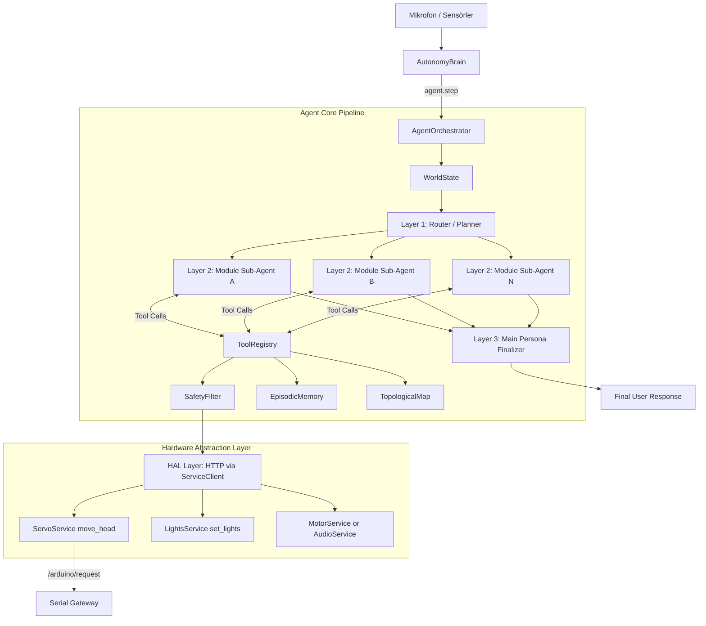

# Agent Core — Mimari Dokümantasyon

## Genel Bakış

Agent Core, SentryBOT'un otonom karar verme, cevreyi algilama ve tool kullanma katmanidir.
Yeni surumde mimari **3 katmanli agent** modeline tasinmistir:

1. Router/Planner katmani
2. Modul bazli Sub-Agent katmani
3. Main Persona (final cevap) katmani

Bu uc katman da tek Ollama modeli uzerinden calisir, sadece sorumluluklari farklidir.

## Modül Yapısı

```
modules/agent_core/
├── xAgentCoreService.py      # Servis başlatıcı
├── config_loader.py          # config.yml okuyucu
├── config/
│   └── config.yml            # Modül ayarları
├── services/
│   ├── __init__.py           # Re-export proxy
│   ├── agent.py              # Ana orkestratör (Native ReAct Loop)
│   ├── safety_filter.py      # Donanım güvenlik sınırlayıcı (servolar vb.)
│   ├── memory.py             # SQLite epizodik bellek (Kalıcı bellek)
│   ├── slam.py               # Topolojik harita + BFS yol bulma
│   ├── tools.py              # LLM araç tanımları (10 adet Native Tool)
│   ├── world_state.py        # Sensör durumu (Pil, ultrasonik vb.)
│   ├── sensor_loop.py        # Arka plan sensör okuyucu (Thread)
│   ├── idle_behavior.py      # Boşta kalma nefes efekti
│   ├── tri_layer.py          # Router + sub-agent profil tanimlari
│   └── runtime/              # Typed cognitive loop (Goal/Plan/Recovery/Traces)
│       ├── schemas.py
│       ├── runtime.py        # AgentRuntime
│       ├── recovery.py
│       ├── capability_index.py
│       ├── progress_tracker.py
│       ├── decision_trace.py
│       ├── companion_plan_adapter.py
│       ├── native_tool_recovery.py
│       ├── companion_execution_loop.py
│       ├── contextual_replanner.py
│       ├── plan_policy_gate.py
│       ├── goal_store.py
│       ├── goal_formation.py
│       ├── goal_candidate_generator.py
│       ├── goal_evaluator.py
│       └── goal_policy_gate.py
├── architecture_agent_core.md# Mimari dokümantasyon
└── README.md                 # Genel bilgi
```

## AgentRuntime (additive)

`AgentRuntime` provides a bounded Observe→Decide→Act→Evaluate→Recover loop with:

- typed `Goal` / `Plan` / `Observation` / `Evaluation`
- `CapabilityIndex` (tool ↔ capability, reads `robot_capability_registry.json`)
- `FailureClassifier` + `RecoveryManager`
- `ProgressTracker` anti-loop guards
- `DecisionTraceStore` (safe summaries, no chain-of-thought)

### Batch 2 integrations

- `CompanionPlanAdapter` — `_plan_for` need templates → typed `Plan` + capability filtering
- `NativeToolRecovery` — `_run_native_history_loop` classifies failures, bounded read-only retry/switch, traces
- API: `GET /agent/decision-traces` and `/agent/decision-traces/latest`

It does **not** replace `AutonomyBrain` or the speech `agent.step()` path.
Use `AgentOrchestrator.create_agent_runtime()` when a multi-step goal needs
structured recovery and traces. Physical actions still pass safety/capability gates.

### Batch 3 integrations

- `CompanionExecutionLoop` — embodied plan steps run through Observation → Evaluation → Recovery → optional Replan
- `CompanionGoalExecutor` delegates to the cognitive loop when `companion_goal_executor.cognitive_loop.enabled` (default true, dry-run unchanged)
- `observation_replan()` — navigation/motion/perception/pose failures append observe-and-wait tail instead of blind continuation
- Shared `DecisionTraceStore` wired from `AgentOrchestrator` via `brain_init.py`
- Side-effect capabilities (`speech.*`, `motion.*`, `navigation.*`, `expression.event`) are never auto-retried; read-only caps can retry/switch
- Deterministic policy (owner guard, quiet hours, risk clamps) stays outside the loop and blocks execution upstream

### Batch 4 integrations

- `ContextualReplanner` — rules-first observation-contextual candidates (`source=rules|llm_assisted|fallback_observe_wait`); optional mocked LLM assist hook (`llm_assist: false` by default)
- `PlanPolicyGate` — approves/rejects candidates before execution (capability, risk ceiling, quiet hours, step budget)
- `observation_replan()` retained as fallback after policy reject / unknown failures
- In-process `GoalStore` + `GoalSnapshot` — ACTIVE/WAITING continuity across life-loop ticks (`ttl_s`, no SQLite in this batch)
- `tick_companion_auto_execute` resumes valid ACTIVE/WAITING goals before need selection; resume still passes auto-execute/safety gates
- Traces: `contextual_replan` + `goal_resume` via existing sanitized `DecisionTraceStore`

### Batch 5 integrations

- `GoalFormationService` — need/context → candidates → evaluate → `GoalPolicyGate` → select/defer/resume/supersede
- Runs on `_update_companion_needs` (think tick); idempotent reuse via context fingerprint (no per-tick goal churn)
- `CompanionPlanAdapter.build_for_intent(intent, goal=...)` — HOW only; intent→template mapping is planning compatibility
- Narrow supersede: urgent safety displacing a valid ACTIVE/WAITING goal (`SUPERSEDED`); expired/invalid use natural terminal states
- `tick_companion_auto_execute` skips execution when `deferred=true`
- Traces: `goal_candidates_generated`, `goal_candidate_rejected`, `goal_selected`, `goal_deferred`, `goal_superseded`

### Batch 6a integrations (single-goal governance)

- Lifecycle hygiene: `GoalStore.cancel`, terminal prune, heal sticky `REPLANNING` (no work → `FAILED`, with work → `WAITING`); execution persist maps sticky replan and calls `complete()` on terminals
- Outcome → evaluator: intent-keyed `record_outcome` / bounded positive/negative score adjustments; companion outcome recording feeds formation evaluator
- Soft interrupt: owner-present + high social may displace low-urgency `WAITING` explore/idle intents (`SUPERSEDE`); safety supersede unchanged; no queue / concurrent goals / background workers
- Pipeline invariant preserved: one foreground goal → GoalFormation → GoalPolicyGate → `build_for_intent` → PlanPolicyGate → ExecutionLoop → Observe→Evaluate→Recover/Replan
- Plan variants deferred (no speculative variant framework)

### Design lock (post–Batch 6a)

**SentryBOT uses a single-foreground-goal autonomy model by design.**
New goals compete during formation; they do not coexist as independently executing goals.

Do **not** introduce a goal queue, background goal workers, concurrent goal executors, or multi-goal priority scheduler unless a dedicated long-horizon audit produces scenario evidence that one foreground goal is behaviorally insufficient.

**Audit result:** `LONG_HORIZON_AUTONOMY_AUDIT.md` — multi-goal not required. Gap was think→execute closed loop.

### Batch 6b integrations (close companion life-loop)

- `_think()` → `_update_companion_needs` → `_maybe_tick_companion_life_loop` → existing `tick_companion_auto_execute` / `CompanionAutoExecuteGate` / `CompanionGoalExecutor` / `CompanionExecutionLoop`
- Config: `companion_auto_execute.life_loop_enabled`, `resume_bypass_cooldown`; cognitive `simulate_on_dry_run` advances GoalStore without hardware
- One gated execution opportunity per think tick; resume bypasses same-plan cooldown so WAITING/ACTIVE progress
- Soft interrupt / safety supersede / fingerprint idempotency unchanged; no queue or second executor path
- Evidence: `tests/modules/agent_core/test_batch6b_life_loop.py`

### Post–Batch 6b posture

Autonomy substrate (Batches 1–6b) is closed enough for end-to-end single-goal life-loop operation.

Do **not** open another implementation batch by default. There is **no Batch 6b follow-on** and **no presumed Batch 7 feature**.

**Next greenlight (when granted):** a **runtime / behavioral-quality audit only** — not implementation. Hypotheses to test (not assume):

1. Intention/context changes over many autonomous ticks
2. Outcome history produces meaningful behavioral adaptation
3. Proactive initiation is useful rather than repetitive
4. Completion appropriately changes the next intention
5. Repeated observations do not cause stale-goal or formation churn
6. Plan diversity is sufficient in real operation
7. Reboot persistence is a gap only if the product requires it

**Implementation rule:** No new abstraction unless runtime evidence demonstrates a specific behavioral deficiency that the smallest existing mechanism cannot address.

**Audit complete:** `RUNTIME_BEHAVIOR_AUDIT.md` — context-sensitive behavior supported; no Batch 7 / no new abstraction. Watches only (template HOW, session learning, agentic parallel path, reboot product-gated).

### Stable autonomy baseline (post–runtime audit)

**Status:** Locked. Batches 1–6b are the **stable autonomy baseline** — behaviorally coherent, not merely architecturally complete.

| Dimension | Baseline |
|-----------|----------|
| Substrate | Batches 1–6b |
| Foreground | Exactly one goal |
| Competition | Formation time only |
| Execution | One governed stack (gate → executor → loop) |
| Persistence | In-process unless product requirements change |
| Planning | Intent-sensitive, template-backed HOW; contextual replan on evidence |
| Learning | Session-scoped outcome feedback |
| Implementation | **No pending Batch 7** justified by current evidence |

**Character:** Context-sensitive with deliberate stability; single-foreground; outcome-aware in-session; autonomous multi-tick progression.

**Watches (not gaps):** template-bound HOW; session-local learning; agentic parallel path; reboot continuity (product-optional). Deterministic cycling is **rejected** as a current problem.

**Future work rule:** Open implementation only when runtime evidence shows a measurable regression or unmet product behavior — not because another numbered batch feels structurally inevitable.

## Veri Akisi (Tri-Layer Agent Flow)



## Modüller Arası Etkileşim

| Modül | Agent Core ile İlişki |
|---|---|
| `autonomy` | Agent Core'u baslatir ve `agent.step()` cagrilarini yonetir. |
| `ollama` | Uc katmanin da ortak LLM backend'idir (tek model stratejisi). |
| `hardware` | Tool cagrilari SafetyFilter sonrasinda ServiceClient uzerinden gider. |
| `camera` / `vlm_bridge` | Gorsel baglami sub-agent katmanina saglar. |
| `speech` / `speak` / `wakeword` | Ses giris-cikis ve uyandirici akislarina domain uzmanligi verir. |
| `gateway` | Agent Core API endpoint'lerini dis sisteme acar. |

## Tasarım Kararları

### Neden Tri-Layer + Native Tool Calling?
Eski tek-katmanli tool loop, farkli domain sorumluluklarini ayni promptta biriktiriyordu.
Yeni yapida router istegi domain sub-agent'lara boler, final persona katmani ise tek bir tutarli cevap uretir.
Bu sayede:
- Modul bazli uzmanlasma artar.
- Prompt karmaşasi azalir.
- Tek model kullanildigi icin operasyonel maliyet ve deployment sadeligi korunur.
