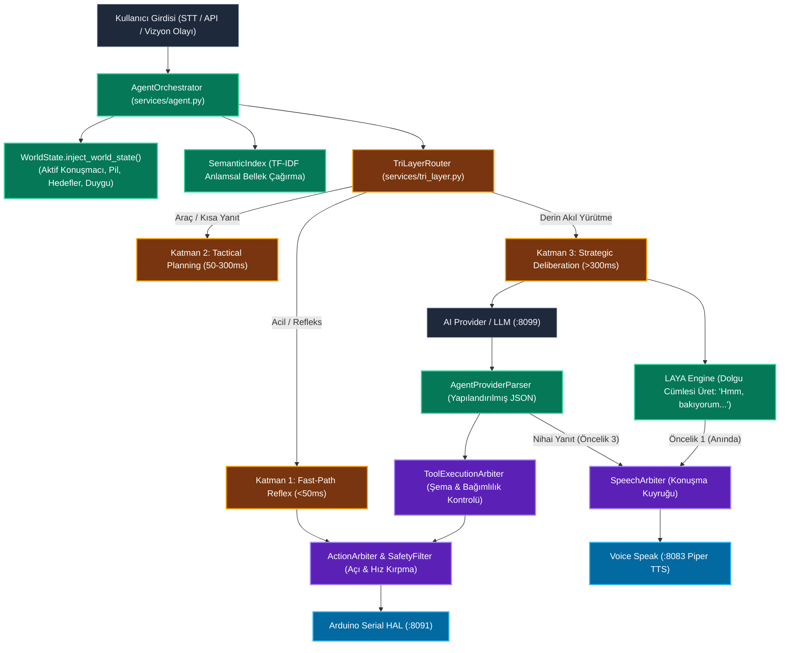
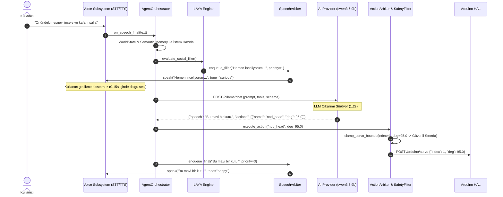

# Agent Core Modülü Mimari ve Teknik Dokümantasyonu (Cognitive Brain & Decision Orchestrator)

> **Modül:** `modules/agent_core`  
> **Kapsam:** `services/agent.py`, `services/tri_layer.py`, `services/laya_engine.py`, `services/action_arbiter.py`, `services/speech_arbiter.py`, `services/world_state.py`, `services/progress.py`, `services/slam.py`, `api/`  
> **Tasarım Deseni:** Tri-Layer Cognitive Architecture, Blackboard / World State Pattern, Priority Speech Arbiter, Social Companion FSM  
> **Varsayılan Port:** Gateway (`:8080`) altında `/agent/*` ve `/chat` olarak sunulur  
> **Temel Rol:** Algı, hafıza, akıl yürütme, güvenlik denetimi ve fiziksel eylemleri orkestre eden merkezi bilişsel beyin

---

## 1. Genel Bakış ve Modül Sorumlulukları

`modules/agent_core`, SentryBOT V5'in en üst seviyedeki karar mekanizması, bilişsel zekâsı ve otonom davranış yöneticisidir. Robotun kamerasından gelen görsel veriyi (`vlm_bridge`), mikrofonundan gelen sesi (`speech`), anlamsal belleğini (`cognitive_memory`) ve anlık çevresel durumunu (`world_state`) bir araya getirerek ne zaman düşüneceğine, ne zaman konuşacağına ve hangi motor eylemini gerçekleştireceğine karar verir.

Modülün temel sorumlulukları şunlardır:

1. **Üç Katmanlı Bilişsel Mimari (Tri-Layer Cognitive Architecture):**
   - **Katman 1: Hızlı Refleks (<50 ms):** Acil durdurma (E-Stop), ani kullanıcı uyanma selamlaması, ani sese doğru kafa çevirme (reflex gaze) gibi derin LLM gerektirmeyen deterministik refleksler.
   - **Katman 2: Taktik Planlama (50-300 ms):** Araç yürütme (tool execution), engelden kaçınma, kısa diyalog tamamlama ve hızlı durum güncellemeleri.
   - **Katman 3: Stratejik Muhakeme (>300 ms):** Çok adımlı akıl yürütme, derin LLM zincirleri (Chain-of-Thought), uzun vadeli hedef parçalama (`ProgressTracker`) ve kişilik uyumu.
2. **LAYA Sosyal Yoldaş Motoru (Language Augmented Yielding Agent):**
   - İnsanlarla etkileşimde robotun mekanik bir komut satırı gibi değil, empatik bir yol arkadaşı gibi davranmasını sağlar.
   - **Dolgu Cümleleri (Latency Fillers):** LLM çıkarımı veya araç yürütmesi 1 saniyeden uzun sürdüğünde robotun garip bir sessizliğe bürünmesini önlemek için konuşma kuyruğuna doğal dolgular (`"Hmm, bir bakayım..."`, `"Hemen kontrol ediyorum..."`) enjekte eder.
3. **Eylem Güvenlik Denetçisi (`ActionArbiter` & `SafetyFilter`):**
   - LLM tarafından önerilen motor açılarını donanımın fiziksel sınırlarına (`SERVO_BOUNDS`) göre kırpar (clamping). Hız sınırlarını aşan veya birbiriyle çakışan fiziksel eylemleri filtreler.
4. **Öncelikli Konuşma Hakemi (`SpeechArbiter`):**
   - Konuşma kuyruğunu üç öncelik seviyesinde yönetir:
     - **Öncelik 1:** LAYA Dolgu Cümlesi (Anında onay).
     - **Öncelik 2:** İlerleme Durumu Bilgilendirmesi.
     - **Öncelik 3:** Nihai LLM Yanıtı.
   - Kullanıcı araya girdiğinde (Barge-In) tüm ses kuyruğunu sıfır gecikmeyle temizler ve konuşmayı susturur.
5. **Birleşik Dünya Durumu (`WorldState`):**
   - Robotun o anki aktif konuşmacısını, bataryasını, yüz ifadesini, konumunu ve hedeflerini tek bir kara tahta (blackboard) modelinde tutar ve LLM sistem istemine dinamik olarak enjekte eder (`inject_world_state`).

---

## 2. Mimari ve Veri Akış Diyagramları

### 2.1 Bilişsel Karar ve Yürütme Akışı (Mermaid Flowchart)


```mermaid
flowchart TD
    classDef input fill:#1e293b,stroke:#64748b,stroke-width:1px,color:#f8fafc;
    classDef tri fill:#78350f,stroke:#f59e0b,stroke-width:2px,color:#fff;
    classDef orch fill:#047857,stroke:#34d399,stroke-width:2px,color:#fff;
    classDef arbiter fill:#5b21b6,stroke:#a78bfa,stroke-width:2px,color:#fff;
    classDef hw fill:#0369a1,stroke:#38bdf8,stroke-width:2px,color:#fff;

    IN["Kullanıcı Girdisi (STT / API / Vizyon Olayı)"]:::input --> ORCH["AgentOrchestrator (services/agent.py)"]:::orch
    
    ORCH --> WS["WorldState.inject_world_state()\n(Aktif Konuşmacı, Pil, Hedefler, Duygu)"]:::orch
    ORCH --> MEM["SemanticIndex (TF-IDF Anlamsal Bellek Çağırma)"]:::orch
    
    ORCH --> ROUTER["TriLayerRouter (services/tri_layer.py)"]:::tri
    
    ROUTER -->|Acil / Refleks| L1["Katman 1: Fast-Path Reflex (<50ms)"]:::tri
    ROUTER -->|Araç / Kısa Yanıt| L2["Katman 2: Tactical Planning (50-300ms)"]:::tri
    ROUTER -->|Derin Akıl Yürütme| L3["Katman 3: Strategic Deliberation (>300ms)"]:::tri

    L3 --> LAYA["LAYA Engine (Dolgu Cümlesi Üret: 'Hmm, bakıyorum...')"]:::orch
    LAYA -->|"Öncelik 1 (Anında)"| SPK_ARB["SpeechArbiter (Konuşma Kuyruğu)"]:::arbiter

    L3 --> LLM["AI Provider / LLM (:8099)"]:::input
    LLM --> PARSER["AgentProviderParser (Yapılandırılmış JSON)"]:::orch

    PARSER --> TOOL_ARB["ToolExecutionArbiter (Şema & Bağımlılık Kontrolü)"]:::arbiter
    TOOL_ARB --> ACT_ARB["ActionArbiter & SafetyFilter (Açı & Hız Kırpma)"]:::arbiter
    
    ACT_ARB --> ARDUINO["Arduino Serial HAL (:8091)"]:::hw
    
    PARSER -->|"Nihai Yanıt (Öncelik 3)"| SPK_ARB
    SPK_ARB --> TTS["Voice Speak (:8083 Piper TTS)"]:::hw

    L1 --> ACT_ARB
```

---

### 2.2 Algıdan Eyleme Uçtan Uca Dizi Diyagramı (Mermaid Sequence)


```mermaid
sequenceDiagram
    autonumber
    actor User as Kullanıcı
    participant Voice as Voice Subsystem (STT/TTS)
    participant Core as AgentOrchestrator
    participant LAYA as LAYA Engine
    participant SpeechArb as SpeechArbiter
    participant LLM as AI Provider (qwen3.5:9b)
    participant Safety as ActionArbiter & SafetyFilter
    participant HW as Arduino HAL

    User->>Voice: "Önündeki nesneyi incele ve kafanı salla"
    Voice->>Core: on_speech_final(text)
    
    Core->>Core: WorldState & Semantic Memory ile İstem Hazırla
    Core->>LAYA: evaluate_social_filler()
    LAYA->>SpeechArb: enqueue_filler("Hemen inceliyorum...", priority=1)
    SpeechArb->>Voice: speak("Hemen inceliyorum...", tone="curious")
    Note over Voice: Kullanıcı gecikme hissetmez (0.15s içinde dolgu sesi)

    Core->>LLM: POST /ollama/chat {prompt, tools, schema}
    Note over LLM: LLM Çıkarımı Sürüyor (1.2s)...
    LLM-->>Core: {"speech": "Bu mavi bir kutu.", "actions": [{"name": "nod_head", "deg": 95.0}]}

    Core->>Safety: execute_action("nod_head", deg=95.0)
    Safety->>Safety: clamp_servo_bounds(index=1, deg=95.0 -> Güvenli Sınırda)
    Safety->>HW: POST /arduino/servo {"index": 1, "deg": 95.0}

    Core->>SpeechArb: enqueue_final("Bu mavi bir kutu.", priority=3)
    SpeechArb->>Voice: speak("Bu mavi bir kutu.", tone="happy")
```

---

## 3. Sınıf, Fonksiyon ve Metot Seviyesi Teknik Referans

### 3.1 `AgentOrchestrator` (`services/agent.py`)

Merkezi karar döngüsünü yöneten sınıf:
- `step(user_text: str, context: Optional[dict] = None) -> Dict[str, Any]`:
  - Algıyı toplar, `WorldState` durumunu günceller.
  - `TriLayerRouter` ile hangi katmanın çalışacağına karar verir.
  - LLM çıktısını ayrıştırır (`AgentProviderParser`).
  - Güvenlik filtresinden geçirerek eylemleri yürütür.
- `turn(user_text: str) -> Generator[str, None, None]`:
  - Metin akışı (SSE streaming) biçiminde parça parça cümle üretir (`agent_streaming.py`).
- `interrupt() -> None`:
  - Kullanıcı konuşmaya başladığında yürütülen planı ve konuşma kuyruğunu anında duraklatır.

---

### 3.2 `TriLayerRouter` (`services/tri_layer.py`)

Bilişsel yükü ve gecikmeyi dengeleyen yönlendirici:
- **Katmanlar ve Zaman Bütçeleri:**
  - `LAYER_1_REFLEX`: $<50$ ms. Anahtar kelimeler: `"dur"`, `"stop"`, `"selam"`, `"merhaba"`, `"iptal"`.
  - `LAYER_2_TACTICAL`: $50-300$ ms. Anahtar kelimeler: `"neredesin"`, `"ışığı aç"`, `"sağa bak"`, `"sesi kıs"`.
  - `LAYER_3_STRATEGIC`: $>300$ ms. Derin planlama, felsefi sorular, görsel nesne analizi, uzun vadeli devriye.
- `route(text: str, urgency: float = 0.5) -> int`: İstem karmaşıklığına ve aciliyet skoruna göre katman numarasını (1, 2 veya 3) döner.
- `max_subagents` denetimi: Aynı anda açılabilecek alt ajan sayısını donanım kaynaklarına göre sınırlar (`test_tri_layer_max_subagents.py`).

---

### 3.3 `LayaEngine` (`services/laya_engine.py`)

Sosyal yoldaşlık ve akıcı konuşma motoru:
- `evaluate_filler(user_text: str, estimated_latency_s: float) -> Optional[str]`:
  - Eğer tahmini işlem süresi 1.0 saniyeden uzunsa duruma uygun dolgu ifadesi seçer:
    - Analiz durumu: `"Bir bakayım..."`, `"Hemen inceliyorum..."`
    - Arama durumu: `"Hafızamı tarıyorum..."`, `"Kontrol ediyorum..."`
- `yield_turn()`: Kullanıcı konuşmaya başladığında robotun sözünü kesmesini sağlayarak insansı nezaket kuralını uygular.

---

### 3.4 `ActionArbiter` & `SafetyFilter` (`services/action_arbiter.py`, `services/safety_filter.py`)

- `clamp_servo(index: int, deg: float) -> float`: Açıları `SERVO_BOUNDS` sınırlarına göre zorunlu kırpar (örn. Pan açısını $10^\circ - 170^\circ$ aralığına kilitler).
- `clamp_stepper_velocity(vx: float, vtheta: float) -> Tuple[float, float]`: Robotun devrilmesini veya kontrolsüz hızlanmasını önlemek için tekerlek hızlarını sınırlar.
- `ToolExecutionArbiter`: Aynı anda iki farklı hareket aracının (örn. hem ileri sürüş hem de yerinde dönme) aynı anda donanıma gönderilmesini önleyen mutex kilidini tutar.

---

### 3.5 `SpeechArbiter` (`services/speech_arbiter.py`)

- `enqueue(text: str, priority: int = 3, tone: Optional[str] = None) -> None`:
  - `priority = 1`: LAYA Dolgusu (Kuyruğun en önüne geçer).
  - `priority = 2`: Ara İlerleme Mesajı (`"Kapıya ulaştım..."`).
  - `priority = 3`: Nihai Yanıt.
- `interrupt() -> None`: Devam eden TTS çıkışını `/speak/stop` ile keser ve bekleyen kuyruğu temizler (`test_speech_interrupt.py`).

---

### 3.6 `WorldState` (`services/world_state.py`)

Merkezi durum deposu:
- `speaker`: O anda konuşan kişinin kimliği veya `"unknown"`.
- `visual_scene`: `vlm_bridge` tarafından sağlanan en güncel sahne ve nesne etiketleri.
- `battery_level`: Donanım batarya yüzdesi.
- `active_subgoals`: `ProgressTracker` tarafından takip edilen aktif görev adımları.
- `inject_world_state(system_prompt: str) -> str`: Sistem isteminin başına robotun anlık gerçek dünya bağlamını ekler.

---

## 4. REST API Endpoint Tablosu (Gateway `:8080` Mount)

| Metot | Uç Nokta | Açıklama | Örnek İstek / Yanıt |
|---|---|---|---|
| `POST` | `/chat` | Kullanıcı ile çok turlu akıllı diyalog | `{"text": "Etrafı tara", "priority": 0}` |
| `POST` | `/agent/step` | Ajan karar döngüsünü tek bir adım yürütür | `{"input": "Kutuyu bul", "context": {...}}` |
| `POST` | `/agent/speech/interrupt` | Robotun konuşmasını acil keser (Barge-In) | Yanıt: `{"ok": true, "interrupted": true}` |
| `GET` | `/agent/status` | Aktif FSM durumu, LAYA modu ve dünya durumunu döner | `{"fsm_state": "idle", "active_speaker": "Emre"}` |
| `POST` | `/agent/memory/recall` | TF-IDF anlamsal bellek sorgular | `{"query": "en sevdiğim renk"}` |

---

## 5. Konfigürasyon Referansı (`agent.yaml` ve `config.yml`)

```yaml
agent_core:
  mode: "companion"            # "companion" veya "security_patrol"
  fsm:
    idle_timeout_s: 30.0
    sleep_timeout_s: 300.0

  tri_layer:
    enabled: true
    max_subagents: 3           # Eşzamanlı maksimum alt ajan sınırı
    reflex_keywords: ["dur", "stop", "iptal", "merhaba"]

  laya:
    enabled: true
    filler_latency_threshold_s: 0.9
    empathy_level: "high"

  safety:
    enforce_clamping: true
    max_linear_speed_mps: 0.4
    max_angular_speed_radps: 1.5

  memory:
    max_working_memory_items: 10
    consolidation_interval_s: 600
```
