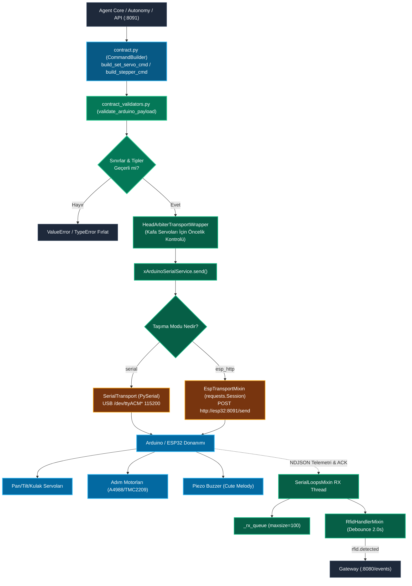
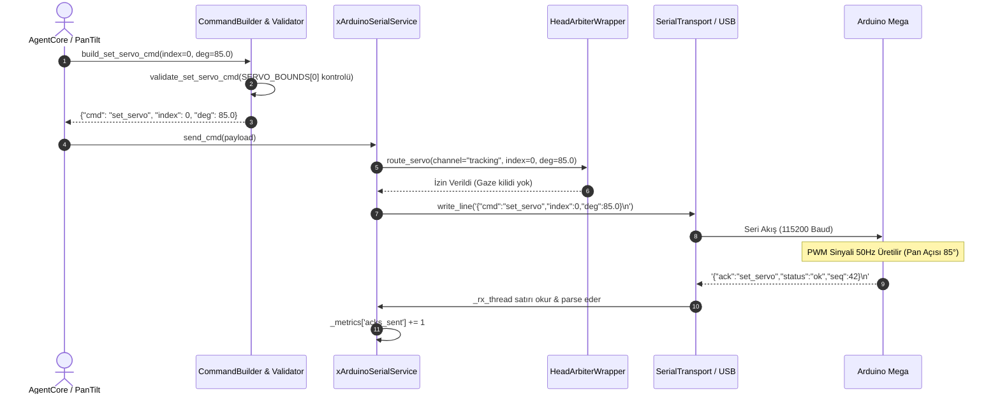

# Arduino Seri Haberleşme Modülü Mimari ve Teknik Dokümantasyonu (Hardware Abstraction Layer)

> **Modül:** `modules/arduino_serial`  
> **Kapsam:** `xArduinoSerialService.py`, `contract.py`, `contract_validators.py`, `transports/`, `services/`, `head_arbiter_integration.py`, `api/router.py`  
> **Tasarım Deseni:** Strict Command Builder Contract, Transport Strategy (Serial/ESP-HTTP), Queue-based Async Loop, Head Control Arbiter Integration  
> **Varsayılan Port:** `8091` (FastAPI REST Server)  
> **Baud Hızı:** `115200` (8N1) | **İletişim Protokolü:** Newline-Delimited JSON (NDJSON)

---

## 1. Genel Bakış ve Modül Sorumlulukları

`modules/arduino_serial`, SentryBOT V5'in yüksek seviyeli yazılım katmanları (Agent Core, Gateway, Autonomy) ile robotun alt seviye mikrodenetleyicileri (Arduino Mega / ESP32) arasındaki donanım soyutlama katmanıdır (HAL - Hardware Abstraction Layer). 

Robotun motorlarını, servolarını (baş ve kulaklar), sensörlerini (RC522 RFID), sesli uyarıcılarını (piezo buzzer / cute catalog) ve lazer işaretleyicisini tek bir standart iletişim protokolüyle kontrol eder.

Modülün temel sorumlulukları şunlardır:

1. **Katı NDJSON Kontratı ve Doğrulama (Contract Enforcement):**
   - **Kritik Kural:** Sistemde elle sözlük/JSON payload üretmek kesinlikle yasaktır. Tüm komutlar `contract.py` içerisindeki `CommandBuilder` fonksiyonları (`build_set_servo_cmd`, `build_stepper_cmd`, `build_drive_cmd` vb.) ile oluşturulur ve `contract_validators.py` tarafından fiziksel açı/hız sınırlarına göre doğrulanır.
2. **Çift Taşıma Katmanı Desteği (Dual Transport Strategy):**
   - **USB/UART Doğrudan Seri Bağlantı (`SerialTransport`):** Raspberry Pi veya PC üzerindeki USB portu üzerinden (`/dev/ttyACM*`, `/dev/ttyUSB*`, `COM*`) PySerial ile 115200 baud hızında çift yönlü iletişim sağlar.
   - **Kablosuz / Ağ Köprüsü (`EspTransportMixin`):** ESP32 üzerinden Wi-Fi/HTTP köprüsüyle çalışır. ESP köprüsünde arıza yaşandığında arka arkaya hata sayacına göre devre kesiciyi (`circuit breaker`) devreye alır ve 120 saniye duraklatır.
3. **Kafa Hakemi Entegrasyonu (`HeadArbiterTransportWrapper`):**
   - Görme (VLM), ses yönü (DoA) ve otonom devriye gibi birden çok kaynağın aynı anda baş servolarına zıt yön komutları göndermesini önlemek için `HeadControlArbiter` ile entegre çalışır.
4. **Asenkron Alım/Gönderim Döngüleri ve Kuyruk Yönetimi (`SerialLoopsMixin`):**
   - Gelen telemetri ve ACK mesajlarını dedicated bir alıcı iş parçacığında (`_rx_thread`) okur, 100 elemanlı kuyrukta tutar ve donanım kilitlenmelerini engeller.
5. **RFID Olay Yönetimi (`RfidHandlerMixin`):**
   - RC522 RFID okuyucusundan gelen etiket UID'lerini 2.0 saniyelik debounce filtresinden geçirerek Gateway EventBus'a yayımlar.

---

## 2. Mimari ve Veri Akış Diyagramları

### 2.1 Komut Doğrulama ve İletişim Akışı (Mermaid Flowchart)



---

### 2.2 Servo Hareketi ve Geri Bildirim Dizi Diyagramı (Mermaid Sequence)



---

## 3. Sınıf, Fonksiyon ve Metot Seviyesi Teknik Referans

### 3.1 `contract.py` ve `contract_validators.py` (Zorunlu Kontrat ve Doğrulayıcılar)

Robot donanımına gidecek tüm JSON paketlerinin oluşturulması için standart API:

```python
# Servo İndeksleri
SERVO_INDEX_PAN = 0
SERVO_INDEX_TILT = 1
SERVO_INDEX_EAR_L = 2
SERVO_INDEX_EAR_R = 3
SERVO_COUNT = 4

# Servo Fiziksel Açı Sınırları
SERVO_BOUNDS: Dict[int, Tuple[float, float]] = {
    SERVO_INDEX_PAN: (10.0, 170.0),    # Baş Yatay Açı (Pan)
    SERVO_INDEX_TILT: (35.0, 145.0),   # Baş Dikey Açı (Tilt)
    SERVO_INDEX_EAR_L: (0.0, 180.0),   # Sol Kulak
    SERVO_INDEX_EAR_R: (0.0, 180.0),   # Sağ Kulak
}
```

#### Komut Üretici Fonksiyonlar (`contract.py`)
- `build_set_servo_cmd(index: int, deg: float) -> Dict[str, Any]`: Belirtilen servo indeksine açı komutu üretir.
- `build_set_pose_cmd(pose: List[float], duration_ms: Optional[int] = None) -> Dict[str, Any]`: 4 servonun birden açısını tek pakette ayarlar.
- `build_stepper_cmd(id_: int, mode: str, value: Any, drive: Optional[Any] = None) -> Dict[str, Any]`: Adım motoru hareket komutu (`mode: "step"`, `"speed"`, `"goto"`).
- `build_drive_cmd(vx: float, vtheta: float, duration_ms: Optional[int] = None) -> Dict[str, Any]`: Diferansiyel sürüş komutu (Doğrusal hız `vx` m/s ve açısal hız `vtheta` rad/s).
- `build_liveliness_cmd(mode: str, enabled: bool, amplitude_deg: Optional[float] = None, period_ms: Optional[int] = None) -> Dict[str, Any]`: Otonom canlılık (doğal baş kıpırdamaları, nefes alma animasyonu) ayarlar.
- `build_cute_cmd(name: str) -> Dict[str, Any]`: Piezo buzzer üzerinden duygusal melodi çalar (`happy`, `sad`, `alarm`, `confirm`).
- `build_laser_cmd(enable: bool) -> Dict[str, Any]`: Hedef işaretleyici lazer modülünü açar/kapatır.
- `build_simple_cmd(cmd: str) -> Dict[str, Any]`: `ping`, `stop`, `home`, `status`, `reboot` gibi parametresiz sistem komutları üretir.

#### Doğrulama Mekanizması (`validate_arduino_payload`)
Her komut gönderilmeden önce `validate_arduino_payload(payload)` kontrolünden geçer:
- Bilinmeyen komutlar `ValueError("unsupported command: ...")` ile reddedilir.
- Sınır dışı açılar (`deg < 10.0` veya `deg > 170.0`) anında yakalanır.
- Sayısal parametrelerin tip denetimi (`int`, `float`, `bool`) kesin olarak yapılır.

---

### 3.2 `xArduinoSerialService.py` (Merkezi Donanım Servisi)

```python
class xArduinoSerialService(RfidHandlerMixin, SerialLoopsMixin, EspTransportMixin, FirmwareHelpersMixin):
    def __init__(self, config_overrides=None, transport_factory=None, head_arbiter=None, ...)
```

#### Önemli Nitelikler ve Durum Yönetimi
- `_transport_mode`: `"serial"` veya `"esp_http"`.
- `_ser`: Aktif `SerialTransport` nesnesi.
- `_rx_thread`: Arka planda donanımı sürekli dinleyen ve satır bazlı NDJSON ayrıştıran iş parçacığı.
- `_rx_queue`: `Queue(maxsize=100)`. Gelen telemetri verilerinin saklandığı thread-safe tampon.
- `_stop`: Servis kapatma olay bayrağı (`threading.Event`).
- `_metrics`: `{"rx_count": 0, "tx_count": 0, "acks_sent": 0}` sayaçları.

#### Temel Metotlar
- `start() -> bool`:
  - Portu otomatik tespit eder (`PortDetector`) veya yapılandırmadan okur.
  - Taşıma katmanını açar.
  - Alıcı döngüsünü (`_rx_thread`) ve kalp atışı denetçisini (`_hb_thread`) başlatır.
- `stop() -> None`: Alıcı thread'i durdurur, portu güvenle kapatır.
- `send(payload: Dict[str, Any]) -> bool`:
  - Payload'ı `validate_arduino_payload` ile doğrular.
  - Aktif taşıma katmanına (`serial` veya `esp_http`) NDJSON formatında iletir.
  - Metriklerde `tx_count` değerini artırır.
- `set_servo(index: int, deg: float) -> bool`:
  - `build_set_servo_cmd` ile komutu oluşturur ve `send()` üzerinden donanıma aktarır.

---

### 3.3 Taşıma Katmanları (`transports/`)

#### `SerialTransport` (`transports/serial_transport.py`)
- Standart `pyserial` sarmalayıcısı.
- `write_line(line: str) -> None`: Satır sonuna `\n` ekleyerek byte akışı halinde yazar.
- `read_line() -> Optional[str]`: Zaman aşımı korumalı olarak tek satır okur ve UTF-8 decode eder.

#### `EspTransportMixin` (`transports/esp_transport.py`)
- ESP32 HTTP köprüsü üzerinden iletişim kurar.
- **Circuit Breaker (Devre Kesici):**
  - Arka arkaya `esp_pause_after_failures` (varsayılan: 5) kez bağlantı hatası alınırsa devre kesici açılır.
  - Servis `esp_pause_sec` (varsayılan: 120 sn) boyunca istek atmayı durdurur (`_esp_paused_until`), sistemi HTTP kilitlenmelerinden korur.

#### `PortDetector` (`services/port_detector.py`)
- Linux üzerinde `/dev/ttyACM*` ve `/dev/ttyUSB*` glob desenlerini tarar.
- Windows ortamında `pyserial.tools.list_ports` ile aktif `COM` portlarını bularak Arduino cihazını otomatik eşleştirir.

---

### 3.4 Kafa Hakemi Entegrasyonu (`HeadArbiterTransportWrapper`)

- Robotun kafa motorları (`index: 0` Pan, `index: 1` Tilt) çoklu alt sistemlerden komut alabilir:
  - Görme Modülü (`vlm_bridge`): İnsan yüzünü takip eder.
  - Ses Modülü (`speech`): Konuşan kişinin ses açısına döner.
  - Otonom Canlılık (`liveliness`): Rastgele çevreye bakınır.
- `HeadArbiterTransportWrapper`, gelen açı komutlarını `HeadControlArbiter` kurallarına göre filtreler; düşük öncelikli canlılık hareketlerinin yüksek öncelikli yüz/ses takibini bozmasını engeller.

---

## 4. REST API Endpoint Tablosu (`:8091`)

| Metot | Uç Nokta | Açıklama | Örnek İstek Gövdesi |
|---|---|---|---|
| `POST` | `/arduino/send` | Doğrulanmış genel NDJSON komutu gönderir | `{"cmd": "ping"}` |
| `POST` | `/arduino/servo` | Belirli bir servoyu hareket ettirir | `{"index": 0, "deg": 90.0}` |
| `POST` | `/arduino/pose` | Tüm kafa servolarını tek seferde konumlandırır | `{"pose": [90.0, 75.0, 45.0, 45.0], "duration_ms": 300}` |
| `POST` | `/arduino/stepper` | Adım motoru sürüş komutu | `{"id": 0, "mode": "step", "value": 200}` |
| `POST` | `/arduino/drive` | Diferansiyel robot sürüşü | `{"vx": 0.2, "vtheta": 0.0, "duration_ms": 1000}` |
| `POST` | `/arduino/cute` | Piezo buzzer'dan duygusal melodi çalar | `{"name": "happy"}` |
| `POST` | `/arduino/liveliness` | Baş canlılık hareketlerini açar/kapatır | `{"mode": "breathing", "enabled": true, "amplitude_deg": 5.0}` |
| `GET` | `/arduino/status` | Seri port bağlantı ve telemetri durumunu döner | Yanıt: `{"connected": true, "port": "/dev/ttyACM0", "metrics": {...}}` |
| `POST` | `/arduino/ping` | Donanıma ping paketi atar ve ACK doğrular | Yanıt: `{"ok": true, "pong": true}` |

---

## 5. Konfigürasyon Referansı (`config.yml` ve `agent.yaml`)

```yaml
arduino_serial:
  transport: "serial"               # "serial" veya "esp_http"
  
  # USB Seri Port Ayarları
  port: "auto"                      # "auto" (otomatik bul) veya "/dev/ttyACM0" / "COM3"
  baudrate: 115200                  # Standart 115200 8N1
  timeout: 1.0                      # Okuma zaman aşımı (saniye)
  write_timeout: 1.0

  # ESP32 HTTP Köprü Ayarları
  esp_base_url: "http://127.0.0.1:8091"
  esp_timeout_sec: 1.2
  esp_connect_timeout_sec: 0.4
  esp_pause_after_failures: 5       # 5 hata sonrası devre kesici açılır
  esp_pause_sec: 120.0              # Devre kesici bekleme süresi

  # Kafa ve Canlılık Ayarları
  head_arbiter_enabled: true
  liveliness:
    enabled: true
    default_mode: "subtle"
    amplitude_deg: 8.0
    period_ms: 1200

  # RC522 RFID Ayarları
  rfid:
    enabled: true
    debounce_sec: 2.0
```
