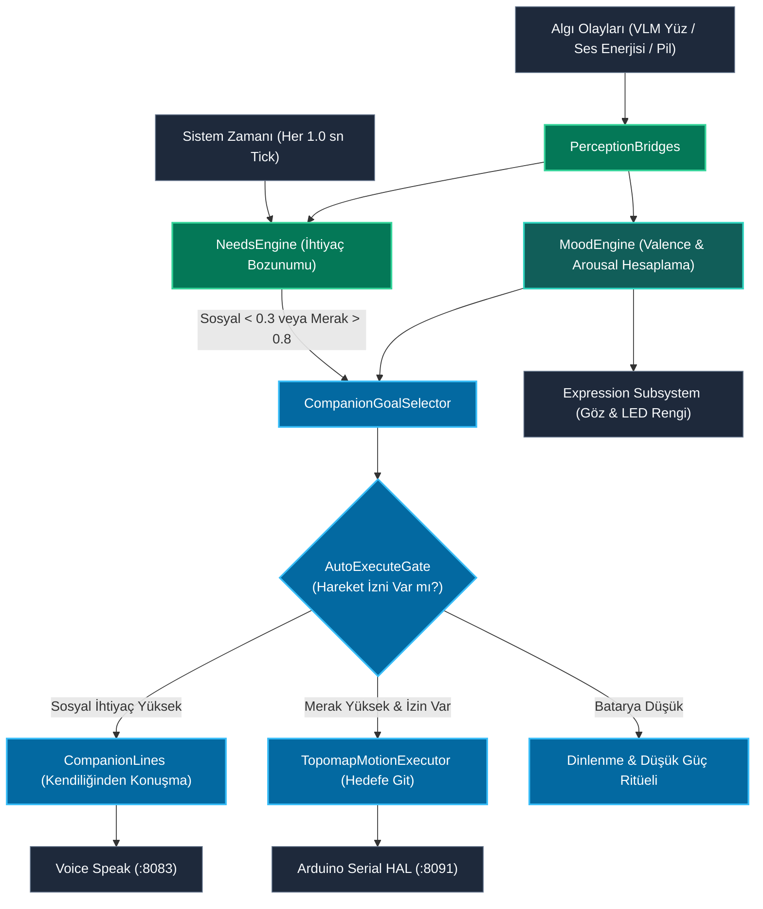
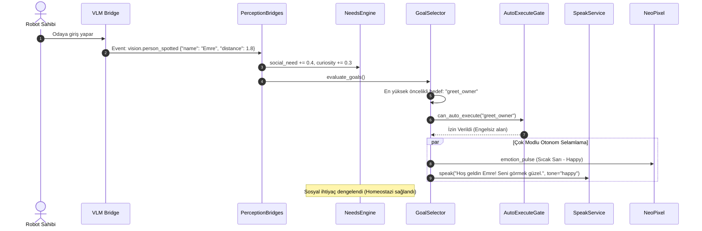

# Otonomi Modülü Mimari ve Teknik Dokümantasyonu (Autonomous Life & Companion Engine)

> **Modül:** `modules/autonomy`  
> **Kapsam:** `services/needs_engine.py`, `services/mood.py`, `services/companion_goal_selector.py`, `services/system1_reflex.py`, `services/topomap_motion_executor.py`, `services/saliency_map.py`, `api/`  
> **Tasarım Deseni:** Homeostatic Needs Drive, 2D Valence-Arousal Mood Space, Behavior Tree / Policy Selector, Saliency Attention Map  
> **Varsayılan Port:** Gateway (`:8080`) altında `/autonomy/*` olarak sunulur  
> **Temel Rol:** Kullanıcıdan bağımsız kendi kendine yaşayan, ihtiyaçları olan, merak duyan, devriye gezen ve sahibine bağlanan otonom yoldaş motoru

---

## 1. Genel Bakış ve Modül Sorumlulukları

`modules/autonomy`, SentryBOT V5'in pasif bir komut dinleyicisi olmaktan çıkıp canlı bir yoldaş robot (companion robot) gibi davranmasını sağlayan otonom yaşam motorudur. Robot, herhangi bir kullanıcı komutu gelmediğinde boşta durmaz; içsel ihtiyaçlarına (`living_needs`), o anki ruh haline (`mood`) ve çevresindeki görsel/işitsel uyaranlara göre kendi hedeflerini belirler.

Modülün temel sorumlulukları şunlardır:

1. **Canlı İhtiyaçlar Motoru (`NeedsEngine`):**
   - Robotun biyolojik benzeri homeostatik ihtiyaçlarını modeller: `energy` (enerji/batarya), `social` (sahibiyle konuşma isteği), `curiosity` (yeni yerleri/nesneleri keşfetme merakı), `play` (oyun/etkileşim) ve `rest` (dinlenme/uyku).
   - Zaman geçtikçe sosyal ihtiyaç ve merak artar; batarya azaldıkça dinlenme/şarj arayışı tetiklenir.
2. **Duygusal Değerlendirme ve Ruh Hali (`MoodEngine`):**
   - 2 boyutlu **Değerlik-Uyarılma (Valence - Arousal)** uzayında robotun anlık ruh halini hesaplar.
   - Tanıdık bir yüz gördüğünde pozitif değerlik artar (`happy`); tehlikeli veya bilinmeyen bir ses duyduğunda uyarılma tavan yapar (`alarmed`); uzun süre yalnız kaldığında canı sıkılır (`bored`).
3. **Kendiliğinden Hedef Seçimi (`CompanionGoalSelector`):**
   - İhtiyaç seviyelerine göre otonom davranış belirler:
     - Sahibi odaya girdiğinde yanına gitme ve selamlama (`seek_owner`).
     - Yeni bir nesne fark ettiğinde merakla yaklaşıp inceleme (`curiosity_inspection`).
     - Yorgun veya gece olduğunda uyku moduna geçme (`rest_recharge`).
     - Belirlenmiş saatlerde esneme, sabah rutini gibi ritüelleri gerçekleştirme (`companion_rituals`).
4. **Kendiliğinden Konuşma (`CompanionLines`):**
   - Kullanıcı soru sormasa dahi ortam durumuna uygun samimi yorumlar üretir (`"Hava karardı, bugün nasıldı?"`, `"O tarafta yeni bir şey gördüm sanırım..."`).
5. **Güvenli Otonom Hareket ve Refleksler:**
   - **Hızlı Refleks (`System1Reflex`):** Önüne aniden bir engel veya evcil hayvan çıktığında $<50$ ms içinde acil fren yapar.
   - **Topolojik Navigasyon (`TopomapMotionExecutor`):** Haritalandırılmış oda noktaları (düğüm grafiği) arasında güvenli rota takibi yapar.

---

## 2. Mimari ve Veri Akış Diyagramları

### 2.1 İhtiyaç Döngüsü ve Otonom Hedef Belirleme (Mermaid Flowchart)



---

### 2.2 Algıdan Otonom Davranışa Dizi Diyagramı (Mermaid Sequence)



---

## 3. Sınıf, Fonksiyon ve Metot Seviyesi Teknik Referans

### 3.1 `NeedsEngine` (`services/needs_engine.py`)

Homeostatik ihtiyaç modeli:
```python
@dataclass
class LivingNeedsState:
    energy: float = 1.0       # 0.0 (Tükenmiş) .. 1.0 (Dolu)
    social: float = 0.5       # 0.0 (Yalnız/İlgisiz) .. 1.0 (Sosyal Doygun)
    curiosity: float = 0.6    # 0.0 (Bıkkın) .. 1.0 (Çok Meraklı)
    play: float = 0.5         # 0.0 .. 1.0
    rest: float = 0.8         # 0.0 (Uykusuz) .. 1.0 (Dinç)
```

- `decay_step(delta_time_s: float) -> None`:
  - `social` ihtiyacı saatte $\approx 0.15$ oranında azalır.
  - `curiosity` ihtiyacı durağan ortamda saatte $\approx 0.20$ oranında yükselir.
- `satisfy_need(need_name: str, amount: float) -> None`: İlgili ihtiyacı pozitif yönde günceller ve $0.0 - 1.0$ aralığında sınırlar.

---

### 3.2 `MoodEngine` (`services/mood.py`)

- **Valence (Değerlik):** $[-1.0, +1.0]$. $-1.0$ (Çok Üzgün / Rahatsız), $0.0$ (Nötr), $+1.0$ (Çok Mutlu).
- **Arousal (Uyarılma):** $[0.0, 1.0]$. $0.0$ (Uykulu / Hareketsiz), $1.0$ (Aşırı Heyecanlı / Tetikte).
- `appraise_event(event_type: str, data: dict) -> Tuple[float, float]`:
  - `visual_hazard`: Valence $-0.6$, Arousal $+0.8$ (Korku / Alarm).
  - `owner_detected`: Valence $+0.8$, Arousal $+0.4$ (Neşe / Sevgi).
  - `idle_timeout`: Valence $-0.2$, Arousal $-0.3$ (Can Sıkıntısı).

---

### 3.3 `CompanionGoalSelector` & `AutoExecuteGate`

- `select_next_goal(state: AutonomyState) -> Optional[CompanionGoal]`:
  - Mevcut ihtiyaç vektörü ve ruh haline göre en yüksek fayda skoruna (`utility score`) sahip hedefi belirler.
- `AutoExecuteGate.can_execute(goal: CompanionGoal) -> bool`:
  - Güvenlik denetimi: Batarya kritik seviyedeyse fiziksel hareket yasaklanır; sessiz saatlerde (quiet hours) sesli konuşma engellenir.

---

### 3.4 `SaliencyMap` (`services/saliency_map.py`)

- Kameradaki tüm algılanan nesneleri dikkat çekicilik puanına göre sıralar:
  $$\text{Skor} = w_{\text{owner}} \times P(\text{sahip}) + w_{\text{motion}} \times \Delta_{\text{hareket}} + w_{\text{novelty}} \times \text{yenilik}$$
- En yüksek puanlı nesneye doğru kafa yönlendirilir (Visual Focus).

---

## 4. REST API Endpoint Tablosu (`:8080/autonomy`)

| Metot | Uç Nokta | Açıklama | Örnek İstek / Yanıt |
|---|---|---|---|
| `GET` | `/autonomy/status` | Aktif otonomi modu, hedef ve ruh halini döner | `{"mode": "idle_companion", "mood": {"valence": 0.4}}` |
| `GET` | `/autonomy/needs` | Tüm canlı ihtiyaç seviyelerini listeler | `{"energy": 0.85, "social": 0.42, "curiosity": 0.78}` |
| `POST` | `/autonomy/goals/select` | Otonom hedef seçimini zorla tetikler | `{"force": true}` |
| `POST` | `/autonomy/speech` | STT transkriptini otonomiye bildirir | `{"text": "Buraya gel", "final": true}` |
| `POST` | `/autonomy/interaction`| Fiziksel veya işitsel etkileşimi kaydeder | `{"type": "touch_head"}` |

---

## 5. Konfigürasyon Referansı (`agent.yaml`)

```yaml
autonomy:
  enabled: true
  companion:
    spontaneous_lines_enabled: true
    min_line_interval_s: 45.0
    quiet_hours:
      start: "23:00"
      end: "07:30"
  needs:
    decay_rates:
      social_per_hour: 0.15
      curiosity_per_hour: 0.20
  safety:
    auto_motion_permitted: true
    max_patrol_distance_m: 5.0
```
