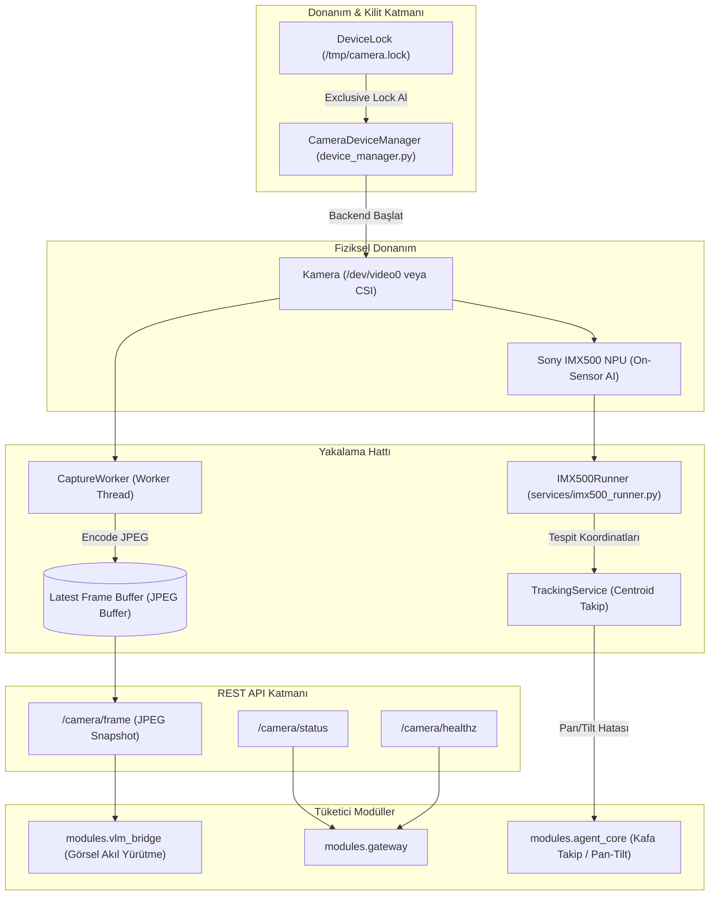
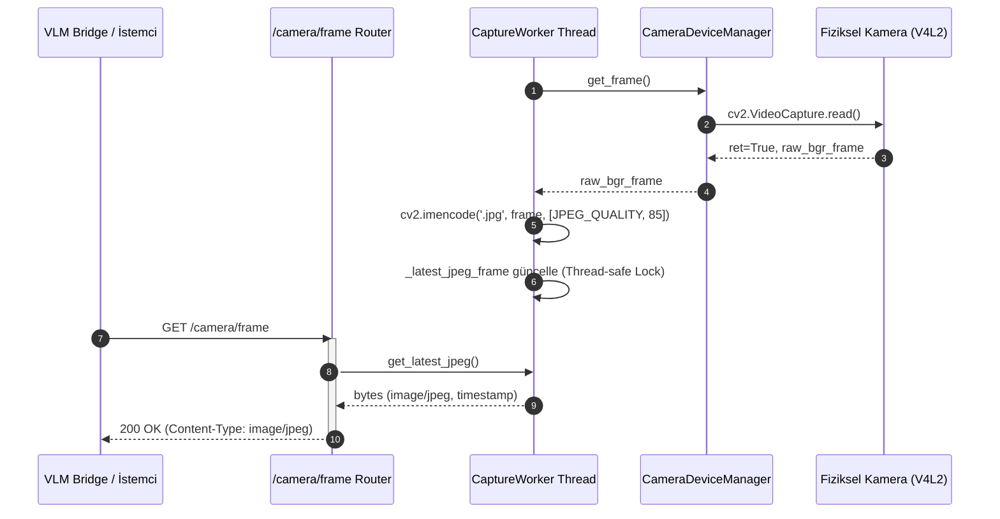

# modules.camera — Mimari ve Teknik Dokümantasyon

> **SentryBOT V5 Görüntü Yakalama, Donanım Yönetimi ve Yapay Zeka Sensör Motoru**  
> Graphviz Kaynak Dosyası: [architecture_camera.dot](file:///c:/Users/emohi/Desktop/Project%20SentryBOT%20V5/modules/camera/architecture_camera.dot)  
> SVG Diyagramı: [architecture_camera.svg](file:///c:/Users/emohi/Desktop/Project%20SentryBOT%20V5/modules/camera/architecture_camera.svg)

---

## 1. Genel Bakış ve Sorumluluklar

`modules.camera`, SentryBOT'un fiziksel dünyayı görmesini sağlayan birincil optik girdi katmanıdır. USB web kameraları, Raspberry Pi Camera v2/v3 ve Raspberry Pi AI Camera (Sony IMX500) donanımlarını otomatik tespit eder; tekil süreç kilidi (`DeviceLock`) ile donanım çakışmalarını önler; kareleri JPEG olarak tamponlar ve REST API üzerinden diğer modüllere sunar.

### Temel Sorumluluk Alanları
1. **Donanım Algılama ve Yönetim (`CameraDeviceManager`):** Linux V4L2 (`/dev/video*`) ve Windows indekslerini tarar, kamera mevcudiyetini doğrular ve uygun arka ucu (backend: Picamera2, OpenCV VideoCapture veya Simülasyon) seçer.
2. **Süreçler Arası Kilit Mekanizması (`DeviceLock`):** Aynı kamera donanımına birden fazla sürecin aynı anda erişerek kaynak kilidine (busy lock) yol açmasını engeller.
3. **Kare Yakalama Döngüsü (`CaptureWorker`, `services/capture.py`):** Hedef kare hızında (varsayılan 15-30 FPS) arka planda kesintisiz kare çeker, RGB/BGR dönüşümü ve JPEG sıkıştırması uygular, en güncel kareyi thread-safe tamponda saklar.
4. **On-Sensor AI Hızlandırması (`IMX500Runner`):** Raspberry Pi AI Camera (Sony IMX500) üzerindeki gömülü sinir ağı işlemcisini (NPU) yönetir; host CPU'ya sıfır yük bindirerek insan, yüz ve nesne kutularını (bounding box) çıkarır.
5. **Görsel Takip Servisi (`TrackingService`):** Tespit edilen nesnelerin merkez koordinatlarını (centroid) hesaplar; robotun kafasının pan/tilt motorlarıyla hedefi takip etmesi için hata farklarını (delta) üretir.
6. **HTTP API Sunucusu (`api/router.py`):** Gateway ve diğer istemciler için `/camera/frame`, `/camera/status`, `/camera/healthz` endpointlerini sunar.

---

## 2. Mimari ve Veri Akış Şemaları

### 2.1 Kamera Veri Akış Şeması (Flowchart)

### 2.2 Kare Yakalama ve İstek Sıralaması (Sequence Diagram)

---

## 3. Bileşen Detayları ve API Sözleşmeleri

### 3.1 `CameraDeviceManager` (`modules/camera/device_manager.py`)
- `probe_devices() -> List[Dict[str, Any]]`
  - Sistemdeki `/dev/video*` aygıtlarını veya Windows indekslerini (0, 1, 2) tarar.
  - Açılabilirlik, desteklenen çözünürlükler ve piksel formatlarını tespit eder.
- `open_camera(device_index: int = 0, width: int = 640, height: int = 480, fps: int = 30) -> bool`
  - Belirtilen parametrelerle kamerayı başlatır. Başarısız olursa güvenli fallback uygular.
- `read_frame() -> Tuple[bool, np.ndarray | None]`
  - Kameradan son BGR matrisini çeker. Hata durumunda `(False, None)` döner.
- `close_camera() -> None`
  - Donanım kaynaklarını serbest bırakır ve kilit dosyasını temizler.

### 3.2 `CaptureWorker` (`modules/camera/services/capture.py`)
- `start() -> None`: Arka plan yakalama iş parçacığını (`daemon=True`) başlatır.
- `stop() -> None`: Yakalama döngüsünü güvenle sonlandırır.
- `get_latest_frame(as_jpeg: bool = True) -> bytes | np.ndarray | None`
  - **Parametreler:** `as_jpeg=True` ise sıkıştırılmış JPEG bayt dizisi, `False` ise ham NumPy BGR matrisi döner.
  - **Dönüş:** En güncel kare baytları veya matrisi.

### 3.3 `IMX500Runner` (`modules/camera/services/imx500_runner.py`)
- `is_available() -> bool`: Sistemde Sony IMX500 AI kameranın takılı olup olmadığını kontrol eder.
- `get_detections() -> List[Dict[str, Any]]`: Sensör üzerinde çalışan NPU'dan nesne etiketlerini (`label`), güven skorunu (`score`) ve sınır kutularını (`box: [x, y, w, h]`) döner.

### 3.4 REST API Endpointleri (`modules/camera/api/router.py`)

| Metot | Yol | Açıklama | Yanıt / Model |
|:---|:---|:---|:---|
| **`GET`** | `/camera/healthz` | Donanım ve servis sağlık kontrolü. | `{"ok": bool, "device_open": bool}` |
| **`GET`** | `/camera/frame` | Son yakalanan tekil JPEG görüntüsü. | `image/jpeg` binary akışı |
| **`GET`** | `/camera/status` | Aktif çözünürlük, gerçek FPS ve backend bilgisi. | `{"backend": str, "fps": float, "resolution": [w, h]}` |
| **`GET`** | `/camera/imx500/status`| IMX500 AI sensörünün çalışma durumu ve NPU yükü. | `{"available": bool, "npu_active": bool}` |

---

## 4. Hata Yönetimi ve Edge-Case Senaryoları

| Senaryo / Edge-Case | Olası Risk | Savunma Mekanizması |
|:---|:---|:---|
| **Kamera Kablosunun Çıkması (Disconnect)** | `read_frame()` bloklanır veya süreç çöker. | `CaptureWorker` arka arkaya 5 boş kare aldığında aygıtı kapatır, 2 saniye aralıklarla otomatik yeniden bağlanma (`auto-reconnect`) dener. |
| **Aygıt Kilit Çakışması (Device Busy)** | Başka bir süreç `/dev/video0`'ı tuttuğunda kamera açılamaz. | `DeviceLock` dosya kilidi kontrol edilir; gerekirse alternatif video indeksine (`/dev/video1`) otomatik geçiş yapılır. |
| **Aşırı İstek Yükü (High Request Rate)** | Her HTTP isteğinde kameradan okuma yapılması FPS düşüşüne yol açar. | Ayrık `CaptureWorker` döngüsü bağımsız çalışır; HTTP istekleri sadece tampon bellekteki son hazır kareyi okur (sıfır ek gecikme). |
| **IMX500 Sensörünün Bulunmaması** | AI kamera modeli başlatılamaz. | `imx500_runner` fail-soft davranır; NPU devre dışı bırakılır ve sistem standart yazılımsal OpenCV pipeline'ına geçer. |

---

## 5. Modüller Arası Giriş ve Çıkışlar

- **Girişler:**
  - Fiziksel kamera optik sensör verisi
  - `config/agent.yaml` altındaki `camera` ayarları (çözünürlük, fps, aygıt yolu)
- **Çıkışlar:**
  - `modules.vlm_bridge`: Çok modlu görsel akıl yürütme için son JPEG kareleri
  - `modules.agent_core`: Centroid hedef takip koordinatları (`pan_error`, `tilt_error`)
  - `modules.gateway`: Sistem izleme ve web paneli için canlı görüntü akışı
