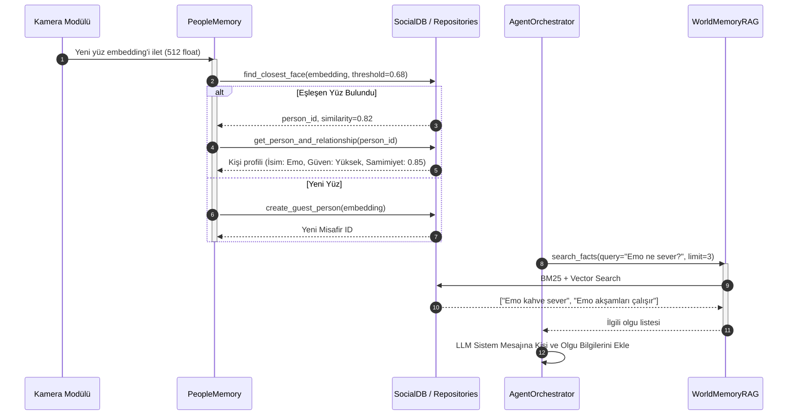

# modules.cognitive_memory — Mimari ve Teknik Dokümantasyon

> **SentryBOT V5 Sosyal, Epizodik ve Bilişsel Bellek Motoru**  
> Graphviz Kaynak Dosyası: [architecture_cognitive_memory.dot](file:///c:/Users/emohi/Desktop/Project%20SentryBOT%20V5/modules/cognitive_memory/architecture_cognitive_memory.dot)  
> SVG Diyagramı: [architecture_cognitive_memory.svg](file:///c:/Users/emohi/Desktop/Project%20SentryBOT%20V5/modules/cognitive_memory/architecture_cognitive_memory.svg)

---

## 1. Genel Bakış ve Sorumluluklar

`modules.cognitive_memory`, SentryBOT'un insanlarla olan etkileşimlerini, gördüğü yüzleri, konuşma diyaloglarını, robot-kullanıcı ilişkilerini ve dünya hakkındaki olgusal bilgileri (world facts) kalıcı olarak saklayan, geri çağıran (retrieval/RAG) ve uyku esnasında konsolide eden bilişsel bellek merkezidir.

### Temel Sorumluluk Alanları
1. **İlişkisel Sosyal Veritabanı (`SocialDB`):** SQLite WAL (Write-Ahead Logging) modunda çalışan, thread-safe, bağlantı havuzlu ve otomatik şema migration destekli veri katmanı.
2. **Kişi ve Yüz Tanıma Hafızası (`PersonRepository`, `FaceDescriptorRepository`):** Kamera modülünden gelen 512 boyutlu yüz embedding vektörlerinin saklanması, kosinüs benzerliği ile eşleştirilmesi ve güven/tanışıklık seviyelerinin takibi.
3. **Epizodik Diyalog ve Olay Kaydı (`ChatEpisodeRepository`, `InteractionEventRepository`):** Kullanıcı ile robot arasındaki geçmiş sohbetlerin, ses tonu/duygu durumlarının ve fiziksel etkileşimlerin zaman damgalı kaydı.
4. **Hibrit RAG Bilgi Motoru (`WorldMemoryRAG`):** Robotun çevresi, sahibi ve kurallar hakkındaki olgusal bilgilerin BM25 anahtar kelime ve vektör benzerliği ile ajan istemine (prompt context) dinamik enjeksiyonu.
5. **Uyku Konsolidasyonu (`SleepConsolidator`):** Robot şarjda veya boştayken geçmiş diyalogları özetleme, tanışıklık puanlarını güncelleme ve önemsiz hatıraları seyreltme (decay).

---

## 2. Mimari ve Veri Akış Şemaları

### 2.1 Bilişsel Bellek Akış Şeması (Flowchart)
```mermaid
flowchart TD
    subgraph Inputs [Dış Veri Girişleri]
        Cam["modules.camera (Yüz Embedding)"]
        Voice["modules.voice / STT (Kullanıcı Sözü)"]
        Agent["modules.agent_core (Diyalog & Kararlar)"]
    end

    subgraph ServiceLayer [Bilişsel Servisler & Akıl Yürütme]
        PM["PeopleMemory (Kişi Çözümleme)"]
        RM["RelationshipMemory (İlişki & Bağlam)"]
        RAG["WorldMemoryRAG (Hibrit Bilgi Getirici)"]
        SC["SleepConsolidator (Uyku Konsolidasyonu)"]
    end

    subgraph RepoLayer [Repository Katmanı (10 Tablo)]
        R_Persons["PersonRepository"]
        R_Faces["FaceDescriptorRepository"]
        R_Rel["RelationshipRepository"]
        R_Episodes["ChatEpisodeRepository"]
        R_World["WorldMemoryRepository"]
        R_Moments["MomentRepository"]
    end

    subgraph DB [Veritabanı Katmanı]
        SDB[("SocialDB (SQLite WAL Modu)")]
    end

    Cam --> PM
    Voice --> Agent
    Agent --> RM
    Agent --> RAG

    PM --> R_Faces
    PM --> R_Persons
    RM --> R_Rel
    RM --> R_Episodes
    RAG --> R_World
    SC --> R_Episodes
    SC --> R_Rel

    R_Persons --> SDB
    R_Faces --> SDB
    R_Rel --> SDB
    R_Episodes --> SDB
    R_World --> SDB
    R_Moments --> SDB

    RM -.->|Prompt Bağlamı Enjeksiyonu| Agent
    RAG -.->|İlgili Olgular & Bilgiler| Agent
```

### 2.2 Kişi Tanıma ve Hafıza Geri Çağırma Sırası (Sequence Diagram)


---

## 3. Veritabanı Şeması ve Tablo Detayları (10 Tablo)

Veritabanı `SocialDB` tarafından yönetilen `data/social.db` dosyasında tutulur:

| Tablo Adı | Birincil Anahtar | Temel Sütunlar | Açıklama |
|:---|:---|:---|:---|
| **`persons`** | `id (TEXT/UUID)` | `name, nickname, role, trust_level, bio, created_at, updated_at` | Tanınan tüm şahısların (Sahip, Aile, Arkadaş, Misafir) profilleri. |
| **`face_descriptors`** | `id (TEXT)` | `person_id (FK), embedding (BLOB), confidence, quality_score, created_at` | 512 boyutlu normalize yüz embedding vektörleri. |
| **`sightings`** | `id (TEXT)` | `person_id (FK), camera_id, bounding_box, timestamp` | Kameranın kişiyi ne zaman ve nerede gördüğünün anlık kayıtları. |
| **`interaction_events`**| `id (TEXT)` | `person_id (FK), type, sentiment_score, metadata_json, created_at` | Konuşma, temas, komut gibi etkileşim olay günlüğü. |
| **`relationships`** | `person_id (FK)` | `familiarity, trust, sentiment, total_interactions, last_interaction` | Robot ile kişi arasındaki samimiyet ve duygusal bağ metrikleri. |
| **`rituals`** | `id (TEXT)` | `person_id (FK), name, trigger_time, action_payload, repetition` | Günlük selamlaşma, uyku öncesi konuşma gibi rutinler. |
| **`moments`** | `id (TEXT)` | `person_id (FK), title, summary, emotional_impact, created_at` | Unutulmaz, yüksek duygu yüklü önemli anılar. |
| **`chat_episodes`** | `id (TEXT)` | `person_id (FK), session_id, role, message, intent, created_at` | Karşılıklı diyalogların ham turn-by-turn geçmişi. |
| **`mood_snapshots`** | `id (TEXT)` | `person_id (FK), robot_mood, user_mood, timestamp` | Etkileşim anında robotun ve kullanıcının duygusal durum kaydı. |
| **`world_memory`** | `id (TEXT)` | `subject, predicate, object, confidence, source, embedding, created_at` | Çevre ve kullanıcı hakkında çıkarılan olgusal bilgiler (RAG havuzu). |

---

## 4. Servis API Sözleşmeleri ve İş Kuralları

### 4.1 `SocialDB` (`modules/cognitive_memory/db.py`)
- `get_social_db(db_path: str | None = None) -> SocialDB`
  - Singleton SQLite yöneticisi. `PRAGMA journal_mode=WAL;` ve `PRAGMA foreign_keys=ON;` ayarlarını açar.
  - Çoklu iş parçacığı güvenliği için `threading.RLock()` ile korunur.
- `execute(query: str, params: tuple = ()) -> sqlite3.Cursor`
- `transaction() -> ContextManager[sqlite3.Connection]`
  - Atomik işlem bloğu; hata oluşursa `ROLLBACK`, başarıyla biterse `COMMIT` eder.

### 4.2 `RelationshipMemory` (`services/relationship_memory.py`)
AgentCore'un robot hafızasına eriştiği üst düzey arayüzdür.
- `ingest_dialogue_turn(person_id: str, user_text: str, robot_text: str, sentiment: float = 0.0) -> None`
  - Konuşmayı `chat_episodes` tablosuna yazar, ilişkideki etkileşim sayısını artırır.
- `get_social_context(person_id: str) -> Dict[str, Any]`
  - Kişinin adını, rolünü, robot ile arasındaki güven/samimiyet seviyesini ve en son konuşulan anıları LLM için özet bir bağlam metni olarak döner.

### 4.3 `WorldMemoryRAG` (`services/world_memory_rag.py`)
- `search(query: str, limit: int = 5, min_score: float = 0.4) -> List[Dict[str, Any]]`
  - Gelen soruyu hem kelime eşleşmesi (BM25) hem de anlamsal kosinüs benzerliği ile tarar.
  - Çift skorlama (hybrid ranking) uygulayarak en güvenilir olguları sıralar.

### 4.4 `SleepConsolidator` (`services/sleep_consolidator.py`)
- `run_consolidation() -> Dict[str, Any]`
  - Robot uyku modundayken tetiklenir:
    1. Günlük konuşmalardaki geçici detayları temizler.
    2. Zaman aşımına uğramış eski misafir profillerini arşivler.
    3. Uzun süredir görülmeyen kişilerin samimiyet puanında hafif bir zaman aşımı indirimi (decay) uygular.

---

## 5. Hata Yönetimi ve Edge-Case Senaryoları

| Senaryo / Edge-Case | Olası Risk | Savunma Mekanizması |
|:---|:---|:---|
| **Eşzamanlı Okuma / Yazma** | `database is locked` hatası. | SQLite `WAL` modu aktiftir; okuma işlemleri yazma işlemlerini asla bloklamaz. |
| **Bozuk / Düşük Kaliteli Yüz Vektörü** | Yanlış kişiye ait profilin güncellenmesi. | `FaceDescriptorRepository`, kalite skoru `< 0.65` olan embedding'leri kaydetmez ve reddeder. |
| **Bilinmeyen / Tanınmayan Kişi** | Sistemin boş dönmesi veya çökmesi. | Otomatik olarak `guest_<uuid>` kimliği üretilir; etkileşimler anonim olarak güvenle kaydedilir. |
| **Disk Dolması veya SQLite Bozulması** | Bellek kaybı. | `SocialDB` açılışta `PRAGMA integrity_check` yapar; arıza durumunda `.corrupt` uzantısıyla yedekleyip temiz şemayı yeniden kurar. |

---

## 6. Modüller Arası Giriş ve Çıkışlar

- **Girişler:**
  - `modules.camera`: Yüz tanıma ve embedding vektörleri (`face_descriptors`)
  - `modules.voice`: Konuşma metinleri ve ses tonu duygu skorları
  - `modules.agent_core`: Ajanın çıkardığı yeni bilgiler ve diyalog adımları
- **Çıkışlar:**
  - `modules.agent_core`: LLM istemi için zenginleştirilmiş kişi ve olgu bağlamı (`social_context`, `relevant_facts`)
  - `modules.system_control`: Durum yöneticisine iletilen aktif kişi profili ve ilişki metrikleri
