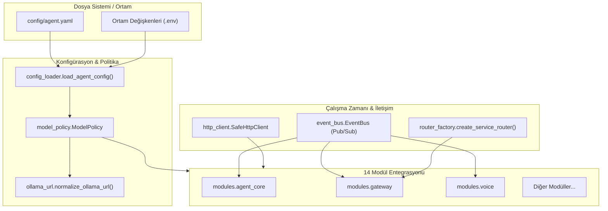
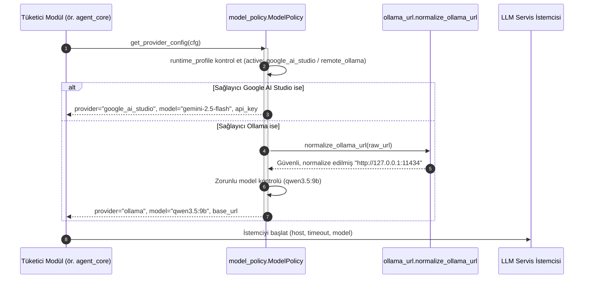

# modules.common — Mimari ve Teknik Dokümantasyon

> **SentryBOT V5 Çekirdek Altyapı ve Ortak Servisler Kütüphanesi**  
> Graphviz Kaynak Dosyası: [architecture_common.dot](file:///c:/Users/emohi/Desktop/Project%20SentryBOT%20V5/modules/common/architecture_common.dot)  
> SVG Diyagramı: [architecture_common.svg](file:///c:/Users/emohi/Desktop/Project%20SentryBOT%20V5/modules/common/architecture_common.svg)

---

## 1. Genel Bakış ve Sorumluluklar

`modules.common`, SentryBOT platformundaki tüm 14 modülün ortak olarak kullandığı temel soyutlama, konfigürasyon, model yönetim politikası, thread-safe olay dağıtımı (event bus) ve HTTP/FastAPI altyapısını sağlayan kütüphanedir. Bu modül bağımsız bir HTTP daemon olarak çalışmaz; tüm modüllerin içine kütüphane seviyesinde entegre edilir.

### Temel Sorumluluk Alanları
1. **Konfigürasyon Yönetimi (`config_loader`):** `agent.yaml` ve modül özelindeki konfigürasyon dosyalarını okuma, hiyerarşik derin birleştirme (`deep_merge`) ve önbelleğe alma.
2. **Model Politikası ve LLM Sağlayıcı Kararı (`model_policy`):** Sistemin yerel Ollama (`qwen3.5:9b`) veya bulut Google AI Studio (`gemini-2.5-flash`) üzerinde çalışmasını garanti altına alan Singleton politika motoru.
3. **Ollama URL Sanitizasyonu (`ollama_url`):** Host ve port çözümü, gateway döngüsel isteklerini engelleme ve ortam değişkeni tabanlı adres normalizasyonu.
4. **Olay Tabanlı İletişim (`event_bus`):** Modüller arası asenkron/senkron olay akışı, halka tampon bellek (ring buffer) ve kanal bazlı filtreleme.
5. **Hata Toleranslı HTTP İstemcisi (`http_client`):** Timeout havuzları, circuit-breaker (devre kesici) ve otomatik yeniden deneme (retry) mekanizması.
6. **Standart Router ve Servis Tabanı (`router_factory`, `service_base`):** Tüm modüller için ortak FastAPI router kalıbı, standart sağlık kontrolleri (`/healthz`) ve yaşam döngüsü (`start`, `stop`).

---

## 2. Mimari ve Veri Akış Şemaları

### 2.1 Bileşen İçi Veri Akışı (Flowchart)

### 2.2 Model Politikası ve İstemci Çözümleme Sırası (Sequence Diagram)

---

## 3. Bileşen Detayları ve API Sözleşmeleri

### 3.1 `modules/common/config_loader.py`
Konfigürasyonların güvenli okunmasını ve harmanlanmasını sağlar.

- `load_agent_config(path: str | Path | None = None) -> Dict[str, Any]`
  - **Parametreler:** Opsiyonel dosya yolu. Belirtilmezse `config/agent.yaml` aranır.
  - **Dönüş:** Birleştirilmiş ve doğrulanmış konfigürasyon sözlüğü.
  - **İş Mantığı:** Dosya varlığını kontrol eder, `runtime_profile` varsa aktif profili ana bölümlerin üzerine yazar (`deep_merge`). Sonuç bellekte önbelleğe alınır.
- `deep_merge(base: Dict[str, Any], update: Dict[str, Any]) -> Dict[str, Any]`
  - İç içe geçmiş sözlükleri rekürsif olarak birleştirir; anahtarlar ezilmeden yeni alanlar eklenir.
- `resolve_agent_cfg_path() -> Path`
  - Çalışma dizini, ebeveyn dizinler ve sistem yollarında `agent.yaml` dosyasını bulur.

### 3.2 `modules/common/model_policy.py`
Robotun beynini oluşturan modellerin seçimini ve katı sözleşmelerini denetler.

- `class ModelPolicy` (Thread-Safe Singleton)
  - `_instance`: Tekil kopya referansı.
  - `_lock`: `threading.Lock` ile korunur.
  - `get_provider_config(cfg: Dict[str, Any]) -> Dict[str, Any]`: Konfigürasyondaki `llm.provider` veya `runtime_profile` değerine bakarak hangi modelin (Ollama vs Google Gemini) aktif olacağını ve adres/anahtar parametrelerini döner.
  - `set_required_model(model_name: str)`: Katı mod aktifken Ollama modelinin `qwen3.5:9b` dışında bir modele sapmasını engeller.

### 3.3 `modules/common/ollama_url.py`
Ollama REST bağlantı adreslerini filtreler ve güvene alır.

- `normalize_ollama_url(value: Any) -> str`
  - Markdown link formatlarını (`[url](url)`), gereksiz boşlukları ve sondaki `/` karakterlerini temizler.
  - `is_bad_ollama_url` ile kontrol eder; eğer adres Gateway'in kendi portuna (`8080`), eksik bir protokole (`http:`) veya `/ollama/chat` endpoint'ine işaret ediyorsa, varsayılan `127.0.0.1:11434` adresine fallback yapar.
- `default_ollama_base_url() -> str`
  - Sırasıyla `SENTRYBOT_OLLAMA_BASE_URL`, `OLLAMA_HOST`, `OLLAMA_BASE_URL` ortam değişkenlerini inceler; yoksa `http://127.0.0.1:11434` döner.

### 3.4 `modules/common/event_bus.py`
Modüller arası asenkron mesajlaşma omurgasıdır.

- `class EventBus`
  - `publish(channel: str, message: Any, metadata: Dict[str, Any] | None = None) -> EventRecord`: Belirtilen kanala olay yazar. Bounded ring-buffer yapısı sayesinde hafıza taşmasını önler.
  - `subscribe(channel: str, callback: Callable[[EventRecord], None]) -> SubscriptionHandle`: İlgili kanala gelen olayları dinlemek için callback kaydeder.
  - `tail(limit: int = 20) -> List[EventRecord]`: Son N olayı döner.
- `get_event_bus() -> EventBus`: Global paylaşılan EventBus örneğini döner.

### 3.5 `modules/common/http_client.py`
Diğer mikroservislere HTTP istekleri gönderirken kilitlenmeleri önler.

- `class SafeHttpClient`
  - Otomatik `timeout` (varsayılan 2.0 saniye), bağlantı havuzu yönetimi (`httpx.Client`) ve hata durumunda exception fırlatmak yerine güvenli fallback yanıtı (`Result[T]`) üretir.

---

## 4. Hata Yönetimi ve Edge-Case Senaryoları

| Senaryo / Edge-Case | Olası Risk | Common Modülü Savunma Mekanizması |
|:---|:---|:---|
| **Eksik veya Hatalı `agent.yaml`** | Servis başlatılamaz ve çökebilir. | `config_loader` dahili `DEFAULT_CONFIG` sözlüğüyle ayağa kalkar; kritik alanları güvenli varsayılanlarla doldurur. |
| **Döngüsel Gateway URL Tanımı** | Ollama yerine Gateway'e istek atılarak sonsuz döngüye girilir. | `ollama_url.is_bad_ollama_url()`, `:8080` portunu tespit ettiği anda adresi reddedip `11434` portuna yönlendirir. |
| **Aşırı Olay Yayını (Event Storm)** | RAM tüketimi artar ve OOM tetiklenir. | `event_bus` halka tampon (ring buffer, varsayılan maks. 1000 kayıt) kullanır; eski kayıtlar otomatik atılır. |
| **Eşzamanlı Model Değişimi** | Çoklu thread yarış durumuna (race condition) girer. | `model_policy.py` hem senkron `threading.Lock()` hem de asenkron `asyncio.Lock()` ile korunur. |

---

## 5. Modüller Arası Giriş ve Çıkışlar

- **Girişler:**
  - `config/agent.yaml`
  - `.env` ortam değişkenleri (`SENTRYBOT_OLLAMA_BASE_URL`, `GEMINI_API_KEY` vb.)
- **Çıkışlar:**
  - Tüm 14 modüle aktarılan konfigürasyon nesnesi
  - Normalize edilmiş ve doğrulanmış LLM bağlantı parametreleri
  - Global `EventBus` olay yayını kanalları (`CORE`, `AUDIO`, `VISION`, `FACE`, `MOVE`, `MEMORY`)
