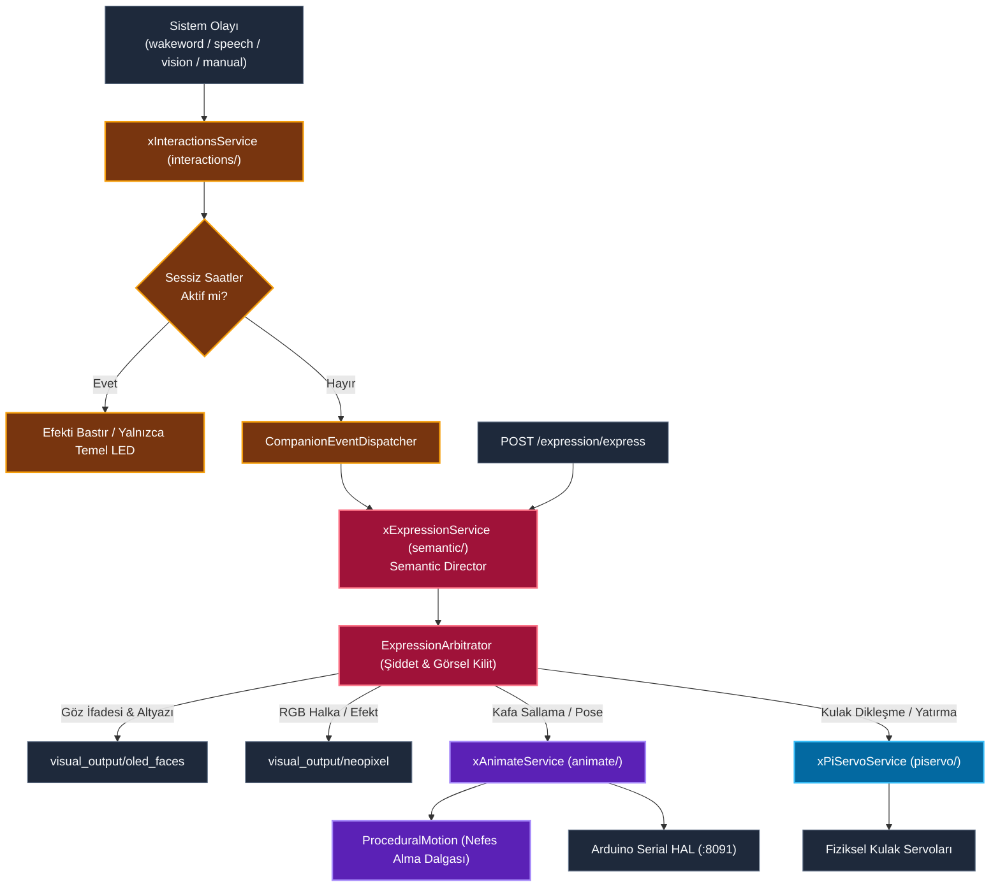
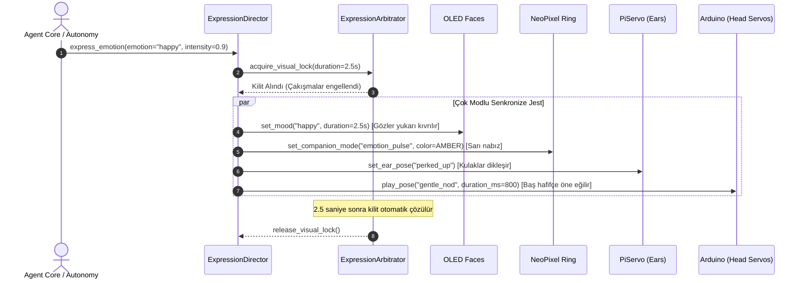

# İfade Modülü Mimari ve Teknik Dokümantasyonu (Unified Expression & Choreography Engine)

> **Modül:** `modules/expression`  
> **Kapsam:** `interactions/`, `animate/`, `piservo/`, `semantic/`, `api/`  
> **Tasarım Deseni:** Director / Choreographer Pattern, Modality Arbitrator, Keyframe Interpolator, Reflex Servo Driver  
> **Varsayılan Port:** Gateway (`:8080`) altında `/expression/*` olarak sunulur  
> **Temel Rol:** Yüz ifadesi (OLED), RGB ışık (NeoPixel), kafa/kulak hareketleri ve ses tonunu tek bir duygusal jestte senkronize eden koreografi motoru

---

## 1. Genel Bakış ve Modül Sorumlulukları

`modules/expression`, SentryBOT V5'in robotik bedenini bir aktör gibi yöneten, tüm ifade kanallarını (gözler, ışıklar, kulaklar, baş hareketleri) tek bir duygu odağında birleştiren merkezi jest ve mimik koreografi motorudur. Robot sevinç, korku veya merak duyduğunda her organın rastgele değil, sinematik bir uyumla eşzamanlı tepki vermesini sağlar.

Alt sistem şu dört temel bileşenden meydana gelir:

1. **`semantic/` (Anlamsal İfade Direktörü):**
   - Robotun üst seviye duygusal durumunu (`happy`, `calm`, `curious`, `sad`, `alarm`) yönetir.
   - İfade şiddetini (`intensity`: $0.0 - 1.0$) ölçekler.
   - Kritik bir jest (örn. kafa sallama) oynatılırken anlık durumların bu hareketi kesmesini önleyen Görsel Durum Kilidi (`visual_lock`) uygular.
2. **`interactions/` (Etkileşim ve Olay Yönlendirici):**
   - Sistem genelinden gelen olayları (`wakeword.triggered`, `speech.start`, `vision.person_spotted`) dinler ve ilgili görsel/işitsel modlara dönüştürür.
   - Gece saatlerinde robotun ani ışık veya ses çıkarmasını engelleyen Sessiz Saatler (`quiet_hours`) kurallarını uygular.
3. **`animate/` (Prosedürel Hareket ve Anahtar Kare Animasyonları):**
   - Önceden koreografisi yapılmış çok eklemli anahtar kare pozlarını oynatır (`sit`, `stand`, `stretch`, `nod`, `shake`).
   - Robot dururken doğal bir canlılık hissi veren sinüzoidal solunum ve kafa kıpırdamalarını (`procedural_motion`) üretir.
4. **`piservo/` (Kulak Servoları ve İşitsel Refleks Motoru):**
   - Robotun sağ ve sol kulak servolarını yönetir (Raspberry Pi PWM veya PCA9685).
   - Ani bir ses duyulduğunda kulakların o yöne dikilmesi (`ear_reflex_left`, `ear_reflex_right`) veya korku/üzüntü anında kulakların arkaya yatması tepkilerini verir.

---

## 2. Mimari ve Veri Akış Diyagramları

### 2.1 Çok Modlu Koreografi ve Yürütme Hattı (Mermaid Flowchart)



---

### 2.2 Duygu Tetiklendiğinde Senkronize Tepki Dizi Diyagramı (Mermaid Sequence)



---

## 3. Sınıf, Fonksiyon ve Metot Seviyesi Teknik Referans

### 3.1 `semantic/xExpressionService.py` (`ExpressionDirector`)

- `express(emotion: str, intensity: float = 1.0, duration_s: float = 2.0, force: bool = False) -> Dict[str, Any]`:
  - `emotion`: SentryBOT standart duygu kelimesi (`happy`, `calm`, `curious`, `sad`, `alarm`, `neutral`).
  - `intensity`: $0.0$ ile $1.0$ arasında jestin abartı katsayısı.
  - `force = True`: Mevcut görsel durum kilidini zorla kırar (acil durumlar için).
- `ExpressionArbitrator`:
  - `_visual_lock_until: float`: Belirlenen süre boyunca başka bir düşük öncelikli duygunun ekranı veya hareketi bölmesini önler (`test_visual_lock_prevents_immediate_switch`).

---

### 3.2 `interactions/xInteractionsService.py`

- `push_event(event_type: str, data: Optional[dict] = None) -> None`:
  - Gelen olayı anında değerlendirir (`wakeword.triggered`, `speech.started`, `person.spotted`).
  - `quiet_hours` kuralını denetler: Belirtilen gece aralığında motor hareketlerini ve parlak LED'leri sınırlar.

---

### 3.3 `animate/xAnimateService.py`

- `run_pose(pose_name: str, duration_ms: Optional[int] = None) -> bool`:
  - Desteklenen pozlar: `sit` (oturma/bekleme duruşu), `stand` (ayağa kalkma), `stretch` (esneme), `nod` (baş sallama onayı), `shake` (hayır/reddetme).
- `ProceduralMotion`:
  - `breathing_step(t: float) -> float`: Doğal solunum hissi için $\sin(\omega t)$ bazlı servo mikrosalınımları üretir.

---

### 3.4 `piservo/xPiServoService.py`

- `set_ear_angles(left_deg: float, right_deg: float) -> bool`:
  - Sol ve sağ kulak servolarını bağımsız veya senkronize olarak $0^\circ - 180^\circ$ arasında konumlandırır.
- `EarReflexEngine`:
  - `trigger_sound_reflex(direction_deg: float)`: Sese doğru kulağı yönlendirir. Sol taraftan ses geldiğinde sol kulak $120^\circ$'ye dikleşir, sağ kulak geriye yatar.

---

## 4. REST API Endpoint Tablosu (`:8080/expression`)

| Metot | Uç Nokta | Açıklama | Örnek İstek Gövdesi |
|---|---|---|---|
| `POST` | `/expression/express` | Bütünleşik çok modlu duygu tetikler | `{"emotion": "happy", "intensity": 0.85, "duration_s": 2.5}` |
| `POST` | `/expression/animate` | Anahtar kare hareketi oynatır | `{"pose": "nod", "duration_ms": 1000}` |
| `POST` | `/expression/ears` | Kulak servolarını doğrudan ayarlar | `{"left_deg": 90.0, "right_deg": 90.0}` |
| `GET` | `/expression/status` | Aktif duygu, görsel kilit ve servo durumunu döner | Yanıt: `{"active_emotion": "happy", "locked": true, ...}` |
| `POST` | `/expression/event` | Etkileşim olayı enjekte eder | `{"type": "vision.person_spotted"}` |

---

## 5. Konfigürasyon Referansı (`agent.yaml` ve `config.yml`)

```yaml
expression:
  enabled: true
  director:
    default_intensity: 0.8
    lock_safety_timeout_s: 5.0

  interactions:
    quiet_hours:
      enabled: true
      start: "23:00"
      end: "07:30"
      allowed_effects: ["subtle_led"]

  animate:
    procedural_breathing: true
    breathing_period_s: 4.0

  piservo:
    driver: "pca9685"          # "pca9685", "pigpio" veya test için "dummy"
    left_ear_channel: 0
    right_ear_channel: 1
```
