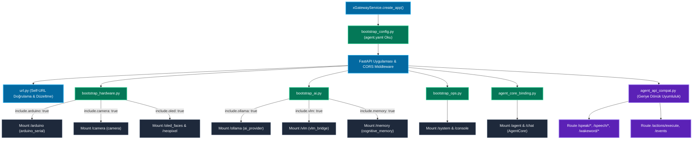
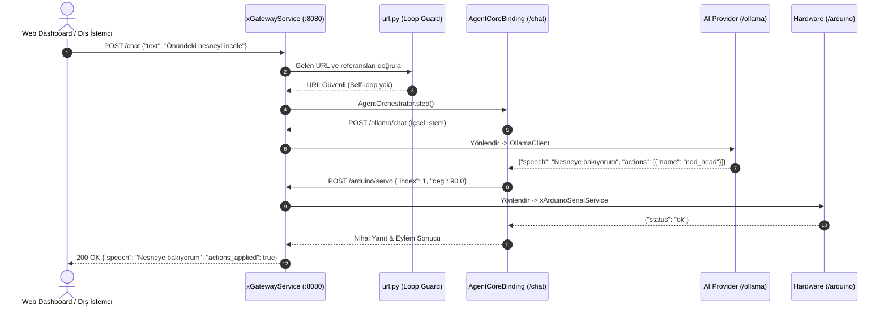

# Gateway Modülü Mimari ve Teknik Dokümantasyonu (Central API Gateway & Route Multiplexer)

> **Modül:** `modules/gateway`  
> **Kapsam:** `xGatewayService.py`, `url.py`, `services/bootstrap*.py`, `services/agent_api_compat.py`, `services/agent_core_binding.py`, `api/router.py`  
> **Tasarım Deseni:** Reverse Proxy, Dynamic Plugin Bootstrapper, Compatibility Facade, Loopback Guard  
> **Varsayılan Port:** `8080` (FastAPI Unified Server)  
> **Temel Rol:** Tüm SentryBOT V5 alt sistemlerini tek bir HTTP/SSE portu altında toplayan merkezi orkestrasyon ağ geçidi

---

## 1. Genel Bakış ve Modül Sorumlulukları

`modules/gateway`, SentryBOT V5'in tüm dış dünya (Web Arayüzü, Mobil Kontrol Paneli, REST API istemcileri) ve modüller arası dahili iletişimi yöneten merkezi ters vekil (reverse proxy) ve API ağ geçididir. 14 farklı alt sistemin her birinin ayrı ayrı portlarda koşarak ağ karmaşası yaratmasını önler; tüm istekleri tek bir standart port (`:8080`) altında toplar ve yönlendirir.

Modülün temel sorumlulukları şunlardır:

1. **Dinamik Modül Başlatma ve Montajı (Modular Bootstrapping):**
   - Merkezi `config/agent.yaml` dosyasındaki bayraklara (`include.camera`, `include.ollama`, `include.voice`, `include.arduino` vb.) göre ilgili servisleri dinamik olarak başlatır ve ana FastAPI uygulamasına alt yönlendirici (`sub-router`) olarak bağlar.
2. **Kendi Kendine Çağrı (Self-URL Loop) Koruması (`url.py`):**
   - Gateway üzerinden LLM veya harici bir servise giden isteklerin yanlış yapılandırma nedeniyle tekrar Gateway'e yönlendirilmesini (`localhost:8080 -> localhost:8080`) engeller. Döngüsel kilitlenmeleri (deadlock) proaktif olarak engeller.
3. **Geriye Dönük Uyumluluk ve Olay Yönlendirme (`agent_api_compat.py`):**
   - Eski sistem çağrılarını (`/speak/say`, `/speech/start`, `/actions/execute`, `/events`) arka planda doğru servislere şeffaf biçimde yönlendirir (Shim layer).
4. **Agent Core Entegrasyonu (`agent_core_binding.py`):**
   - Robotun bilişsel beyni olan `AgentOrchestrator` nesnesini Gateway yaşam döngüsüne (lifespan) bağlar; `/agent/*` ve `/chat` uç noktalarını sunar.
5. **Birleşik / Dağıtık Çalışma Desteği:**
   - İster tüm alt sistemler Gateway içerisinde tek bir monolitik süreç olarak çalışsın, ister alt sistemler bağımsız portlarda mikroservis olarak koşsun; Gateway her iki senaryoyu da şeffafça yönetir.

---

## 2. Mimari ve Veri Akış Diyagramları

### 2.1 Gateway Önyükleme ve Dinamik Montaj Akışı (Mermaid Flowchart)



---

### 2.2 Birleşik API İstek Yönlendirme Dizi Diyagramı (Mermaid Sequence)



---

## 3. Sınıf, Fonksiyon ve Metot Seviyesi Teknik Referans

### 3.1 `xGatewayService.py` (Merkezi Ağ Geçidi Uygulaması)

```python
def create_app(config_path: Optional[str] = None) -> FastAPI:
    ...
```

#### Yaşam Döngüsü (`@asynccontextmanager lifespan`)
- Servis ayağa kalkarken `bootstrap_all()` çalıştırarak tüm seçili alt modülleri başlatır.
- Kapanışta arka planda koşan tüm dinleyici iş parçacıklarını (`threads`) ve donanım bağlantılarını güvenle sonlandırır.

#### Middleware ve Güvenlik
- **CORS Middleware:** Web panelinin farklı portlardan veya domainlerden API'ye erişebilmesini sağlar (`allow_origins=["*"]`).
- **Gzip & Streaming:** Büyük telemetri ve VLM Base64 resim verileri için düşük gecikmeli veri aktarımı.

---

### 3.2 Önyükleyiciler (`services/bootstrap*.py`)

#### `bootstrap_config.py`
- `load_gateway_config()`: `config/agent.yaml` dosyasını okur.
- `evaluate_inclusion_flags()`: Aşağıdaki yapılandırma bayraklarını denetler:
  - `include.camera`: Kamera akış ve yakalama servisini bağla.
  - `include.arduino`: Seri donanım servisini bağla.
  - `include.ollama`: LLM yapay zekâ servisini bağla.
  - `include.voice`: Konuşma tanıma ve sentez servislerini bağla.
  - `include.visual_output`: Ekran ve LED servislerini bağla.

#### `bootstrap_hardware.py`
- `mount_hardware_services(app: FastAPI, cfg: dict)`:
  - `modules.arduino_serial.api.router` $\rightarrow$ `/arduino`
  - `modules.camera.api.router` $\rightarrow$ `/camera`
  - `modules.visual_output.oled_faces.api.router` $\rightarrow$ `/oled_faces`
  - `modules.visual_output.neopixel.api.router` $\rightarrow$ `/neopixel`

#### `bootstrap_ai.py`
- `mount_ai_services(app: FastAPI, cfg: dict)`:
  - `modules.ai_provider.api.router` $\rightarrow$ `/ollama` (Sağlayıcı ister yerel Ollama, ister Google AI Studio olsun prefix standart `/ollama` kalır).
  - `modules.vlm_bridge.api.router` $\rightarrow$ `/vlm`
  - `modules.cognitive_memory.api.router` $\rightarrow$ `/memory`

#### `agent_core_binding.py`
- `bind_agent_core(app: FastAPI, cfg: dict)`:
  - `AgentOrchestrator` örneğini oluşturur ve `app.state.agent` alanına bağlar.
  - `/agent/step`, `/agent/status`, `/agent/speech/interrupt` uç noktalarını ekler.

#### `agent_api_compat.py` (Uyumluluk Katmanı)
- Bağımsız çalışan modül API'lerinin Gateway kök dizininde standart isimlerle çağrılabilmesini sağlar:
  - `POST /speak/say` $\rightarrow$ Speak servisine yönlendirilir.
  - `POST /speech/start` $\rightarrow$ Speech servisine yönlendirilir.
  - `POST /actions/execute` $\rightarrow$ `ActionArbiter` motoruna yönlendirilir.
  - `POST /events` $\rightarrow$ Sistem genel EventBus mekanizmasına iletilir.

---

### 3.3 `url.py` (URL ve Döngü Koruması)

- `normalize_gateway_url(raw_url: str) -> str`: Eksik şemaları (`http://`) tamamlar, trailing slash'leri temizler.
- `is_gateway_self_url(target_url: str, gateway_port: int = 8080) -> bool`:
  - `target_url` hedefinin Gateway'in kendi portunu (`8080`) ve yerel IP'lerini (`127.0.0.1`, `localhost`, `0.0.0.0`) gösterip göstermediğini analiz eder.
  - Eğer gösteriyorsa, LLM veya VLM isteklerinin kendi içine sonsuz döngüye girmesini engeller.

---

## 4. REST API Endpoint Tablosu (`:8080`)

Gateway, tüm sistemin ana giriş kapısı olduğu için aşağıdaki birleşik API şemasına sahiptir:

| Kök Önek | Modül | Açıklama |
|---|---|---|
| `/healthz` | Gateway | Merkezi sistem sağlık durumu ve aktif modül listesi |
| `/status` | Gateway | Sistem metrikleri, CPU/RAM ve çalışma zamanı |
| `/chat` | AgentCore | Kullanıcı ile tek/çok turlu konuşma ve eylem yürütme |
| `/agent/*` | AgentCore | Bilişsel durum, FSM, hedef ilerleme ve manuel adımlama |
| `/arduino/*` | ArduinoSerial | Servo açıları, adım motorları, telemetri, buzzer |
| `/camera/*` | Camera | JPEG kare yakalama, RTSP yayın kontrolü, IMX500 |
| `/vlm/*` | VLM Bridge | Sahne açıklaması, nesne analizi, yüz duygusu |
| `/ollama/*` | AI Provider | LLM metin üretimi, akış (stream), kişilik yönetimi |
| `/memory/*` | CognitiveMemory | Epizodik ve anlamsal bellek sorgulama, konsolidasyon |
| `/speak/*` | Voice (Speak) | Konuşma sentezi (TTS), 0ms durdurma (Barge-In) |
| `/speech/*` | Voice (Speech) | Konuşma tanıma (STT), DoA ses yönü tayini |
| `/oled_faces/*`| Visual Output | SSD1306 OLED yüz ifadeleri ve altyazı gösterimi |
| `/neopixel/*` | Visual Output | WS2812B RGB LED halka ve efekt yönetimi |
| `/system/*` | System Control | Robot yeniden başlatma, kapatma, servis yönetimi |

---

## 5. Konfigürasyon Referansı (`agent.yaml`)

```yaml
gateway:
  host: "0.0.0.0"
  port: 8080
  cors_origins: ["*"]
  request_timeout_sec: 30.0

# Alt Sistem Montaj Bayrakları
include:
  camera: true
  arduino: true
  ollama: true
  voice: true
  visual_output: true
  vlm: true
  memory: true
  agent_core: true
  system_control: true
```
