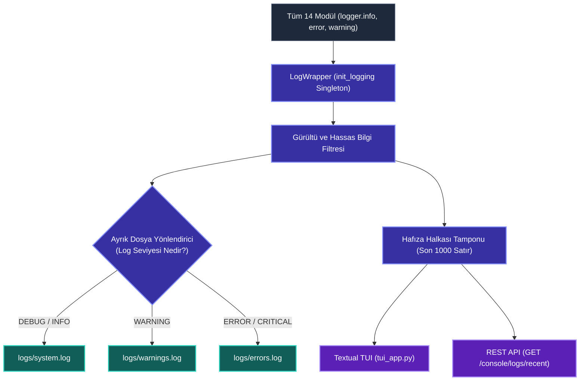
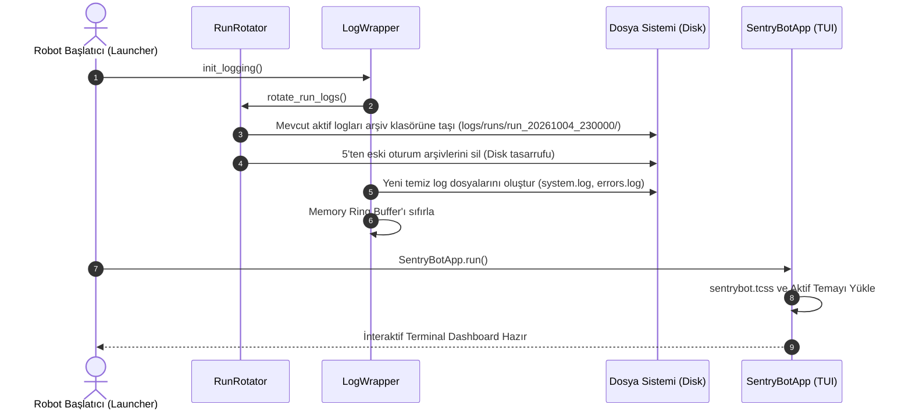

# Runtime Console Modülü Mimari ve Teknik Dokümantasyonu (TUI Dashboard & Central Logging)

> **Modül:** `modules/runtime_console`  
> **Kapsam:** `tui_app.py`, `logwrapper/`, `themes.py`, `system_info_tui.py`, `dashboard.py`, `renderer.py`, `widgets/`, `api/`  
> **Tasarım Deseni:** Terminal User Interface (Textual TUI / Rich), Central Log Multiplexer, Run Session Rotator, Ring Buffer Memory Sink  
> **Varsayılan Port:** Gateway (`:8080`) altında `/console/*` olarak sunulur  
> **Temel Rol:** Tüm sistemin loglarını toplayan, gürültüyü süzüp dosyalara ayıran ve operatöre zengin interaktif terminal paneli sunan arayüz

---

## 1. Genel Bakış ve Modül Sorumlulukları

`modules/runtime_console`, SentryBOT V5'in yerel terminal arayüzü ve tüm modüllerin kullandığı merkezi günlük kaydı (logging) altyapısıdır. Robotun çalışması esnasında oluşan yüz binlerce satırlık teknik log karmaşasını düzenler, kritik hataları (`ERROR`, `WARNING`) ayrı dosyalara ayırır ve operatörün SSH veya doğrudan monitör üzerinden robotu izlemesini sağlayan zengin bir terminal konsolu (TUI) sunar.

Modülün temel sorumlulukları şunlardır:

1. **Merkezi Günlük Altyapısı (`logwrapper`):**
   - 14 modülün tamamında `from modules.runtime_console.logwrapper import init_logging` ile çağrılan tekil log yapılandırmasını yönetir.
   - **Ayrık Dosya Yönlendirmesi (`SeparateFileRouting`):** Logları önem derecesine göre otomatik olarak `logs/system.log`, `logs/warnings.log`, `logs/errors.log` ve `logs/tui.log` dosyalarına dağıtır.
   - **Oturum Döndürücüsü (`RunRotator`):** Robot her yeniden başladığında önceki oturumun loglarını arşivler (`logs/runs/run_YYYYMMDD_HHMMSS/`) ve 5'ten eski oturumları disk şişmesini önlemek için otomatik temizler (`pruning`).
2. **Textual Tabanlı İnteraktif Terminal Konsolu (`tui_app.py`):**
   - Python `Textual` ve `Rich` kütüphanelerini kullanarak modern, sekmeli ve klavyeyle kontrol edilebilir bir konsol uygulaması (`SentryBotApp`) sunar.
   - Canlı telemetri grafikleri (CPU, RAM, batarya sparkline'ları), alt sistem süreç kontrol butonları (Başlat/Durdur) ve kayan log penceresi barındırır.
3. **Dinamik Tema Motoru (`themes.py` & `sentrybot.tcss`):**
   - Dark, Cyberpunk ve Monokai gibi renk paletlerini destekler. Textual CSS (`.tcss`) kurallarını derler.
4. **Hafıza Halkası Tamponu (Memory Ring Buffer):**
   - Son 1000 log kaydını bellekte tutarak TUI ekranına ve REST API'ye anlık gecikmesiz akış sağlar.

---

## 2. Mimari ve Veri Akış Diyagramları

### 2.1 Günlük Kayıtlarının Ayrıştırılması ve TUI Akışı (Mermaid Flowchart)



---

### 2.2 Oturum Başlatma ve Günlük Döndürme Dizi Diyagramı (Mermaid Sequence)



---

## 3. Sınıf, Fonksiyon ve Metot Seviyesi Teknik Referans

### 3.1 `logwrapper/` (Merkezi Log Altyapısı)

- `init_logging(level: int = logging.INFO, run_rotation: bool = True) -> None`:
  - Kök Python `logging` yapılandırmasını kurar.
  - Tekrarlanan kütüphane loglarını (örn. `urllib3`, `PIL`, `asyncio`) filtreler.
- `RunRotator` (`services/run_rotator.py`):
  - `rotate_run_logs(logs_dir: Path, max_runs: int = 5) -> None`:
    - Çalışma dizinindeki `*.log` dosyalarını bir önceki oturum adı altında arşivler (`test_rotate_run_logs_moves_files_and_prunes_older_runs`).
- `SeparateFileRoutingHandler`:
  - `emit(record: LogRecord) -> None`:
    - Seviye bazlı dosya akışına yazar (`test_separate_warning_error_and_tui_files`).

---

### 3.2 `tui_app.py` (`SentryBotApp`)

Textual tabanlı asenkron terminal uygulaması:
- **Sekmeler (Tabs):**
  - `TabMain`: Canlı log akışı, servis sağlık kartları ve süreç yeniden başlatma düğmeleri.
  - `TabTelemetry`: CPU, RAM, SoC Sıcaklık ve batarya grafik geçmişi.
  - `TabConfig`: `agent.yaml` ve `config.yml` ağaç yapısı ve Tree-Sitter sözdizimi vurgulayıcısı.
- **Klavye Kısayolları:**
  - `q`: Uygulamadan çıkış.
  - `t`: Tema değiştirme (Dark $\rightarrow$ Cyberpunk $\rightarrow$ Monokai).
  - `c`: Konsol loglarını temizleme.
  - `1..3`: Sekmeler arasında hızlı geçiş.

---

### 3.3 `themes.py` (Tema ve Stil Yöneticisi)

- `ThemeRegistry`:
  - Desteklenen temalar: `dark_matter`, `cyberpunk_neon`, `monokai_pro`.
  - TCSS (`sentrybot.tcss`) dosyasındaki CSS değişkenlerini (`$primary`, `$accent`, `$background`) seçilen temaya göre derler (`test_all_themes_compile_stylesheet`).

---

## 4. REST API Endpoint Tablosu (`:8080/console`)

| Metot | Uç Nokta | Açıklama | Örnek Yanıt |
|---|---|---|---|
| `GET` | `/console/healthz` | Konsol ve log sisteminin sağlık durumu | `{"ok": true, "log_count": 420}` |
| `GET` | `/console/logs/recent` | Bellekteki son $N$ satır logu döner | `{"logs": ["[INFO] [camera] Frame captured", ...]}` |
| `POST` | `/console/theme` | Aktif TUI temasını değiştirir | `{"theme": "cyberpunk_neon"}` |

---

## 5. Konfigürasyon Referansı (`agent.yaml`)

```yaml
runtime_console:
  enabled: true
  tui:
    theme: "dark_matter"
    refresh_rate_hz: 4.0
    show_sparklines: true
  logging:
    level: "INFO"
    max_history_runs: 5
    separate_error_files: true
    ring_buffer_size: 1000
```
