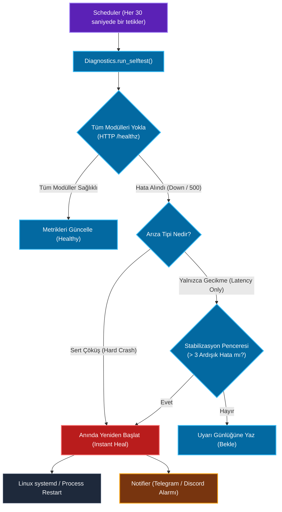
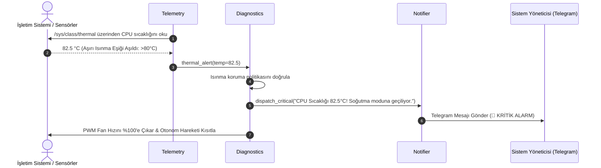

# Sistem Kontrol Modülü Mimari ve Teknik Dokümantasyonu (Platform Operations & Diagnostics)

> **Modül:** `modules/system_control`  
> **Kapsam:** `config_center/`, `diagnostics/`, `notifier/`, `scheduler/`, `state_manager/`, `telemetry/`  
> **Tasarım Deseni:** Autonomous Self-Healing FSM, Dynamic Runtime Config Registry, Observer Pattern (Telemetry), Multi-Channel Notifier  
> **Varsayılan Port:** Gateway (`:8080`) altında `/system/*` olarak sunulur  
> **Temel Rol:** Donanım ve yazılım sağlığını izleyen, arızalanan servisleri otonom olarak yeniden başlatan, telemetri toplayan ve operasyonel ayarları yöneten platform altyapısı

---

## 1. Genel Bakış ve Modül Sorumlulukları

`modules/system_control`, SentryBOT V5'in arka plandaki koruyucu meleğidir (watchdog & platform operations). Robotun işletim sistemi seviyesindeki donanım kaynaklarını (CPU yükü, RAM tüketimi, SoC sıcaklığı), alt sistemlerin yanıt verme sürelerini ve servislerin çökme durumlarını 7/24 denetler.

Alt sistem şu 6 temel servisten meydana gelir:

1. **`diagnostics/` (Teşhis ve Otonom Kendini İyileştirme - Self-Healing):**
   - Tüm modüllerin derin sağlık kontrollerini (`deep_health`) periyodik olarak koşturur.
   - Bir servis çöktüğünde veya yanıt vermeyi kestiğinde operatör müdahalesine gerek kalmadan ilgili süreci veya systemd servisini **otonom olarak yeniden başlatır** (`self_heal`).
   - Geçici ağ yavaşlıklarında yanlış alarm üretmemek için **Stabilizasyon Penceresi (`stabilization window`)** kuralını uygular.
2. **`config_center/` (Dinamik Yapılandırma Merkezi):**
   - Çalışma zamanında (runtime) ayarların yeniden başlatma gerektirmeden dinamik olarak uygulanmasını sağlar (`test_runtime_apply.py`).
   - API anahtarlarını ve gizli şifreleri maskeler (`sensitive_redaction`).
   - Donanım profillerini birleştirir (PC Geliştirme vs Raspberry Pi Donanım).
3. **`telemetry/` (Donanım Telemetrisi ve Sayaçlar):**
   - CPU, GPU, RAM, disk kullanımı ve işlemci sıcaklığını arka planda örnekler ve metrik havuzuna (`gauges`) yazar.
4. **`scheduler/` (Zamanlanmış Görev Motoru):**
   - Periyodik cron ve zamanlayıcı görevlerini koşturur (saatlik bellek konsolidasyonu, 5 dakikalık diagnostik taraması).
   - Çakışan görevleri engeller (`deduplication`).
5. **`state_manager/` (Kalıcı Durum Yöneticisi):**
   - Robot yeniden başlasa dahi dominant ruh halini, çalışma modunu ve son operasyonel verileri diskte saklar.
6. **`notifier/` (Çok Kanallı Bildirim Yöneticisi):**
   - Kritik donanım alarmlarını (aşırı ısınma, düşük voltaj, servis çökmesi) Webhook, Telegram veya Discord üzerinden operatöre iletir.

---

## 2. Mimari ve Veri Akış Diyagramları

### 2.1 Otonom Teşhis ve Kendini İyileştirme Akışı (Mermaid Flowchart)



---

### 2.2 Telemetri ve Bildirim Dizi Diyagramı (Mermaid Sequence)



---

## 3. Sınıf, Fonksiyon ve Metot Seviyesi Teknik Referans

### 3.1 `diagnostics/` (Teşhis ve Kendini İyileştirme)

- `run_selftest() -> Dict[str, Any]`:
  - 14 modülün `/healthz` uç noktalarına HTTP GET atar.
  - Yanıt süresi (`latency_ms`) ve HTTP durum kodlarını inceler.
- `SelfHealController`:
  - `hard_failure_action(module_name: str)`: Süreç ölmüşse veya bağlantı reddedilmişse (`ConnectionRefusedError`), beklemeden `systemctl restart sentrybot-<module>` komutunu yürütür (`test_selftest_heals_immediately_on_hard_failure`).
  - `latency_stabilization_check()`: Eğer modül çalışıyor ancak yavaş yanıt veriyorsa (örn. yoğun LLM çıkarımı), 3 döngü boyunca bekler (`stabilization window`); geçici yük azaldığında gereksiz servis yeniden başlatmalarını önler.

---

### 3.2 `config_center/` (Dinamik Yapılandırma)

- `RuntimeRegistry`:
  - Çalışma zamanında güncellenebilir anahtarları (`registered_keys`) doğrular.
  - `sensitive_redaction(config_dict)`: `api_key`, `token`, `secret`, `password` içeren anahtarları `***REDACTED***` ile maskeleyerek günlüklere veya API yanıtlarına şifre sızmasını önler (`test_sensitive_redaction`).
  - `apply_runtime_profile(profile_name: str)`: `pc` veya `raspberry_pi` profillerini anında yapılandırmaya enjekte eder.

---

### 3.3 `telemetry/` (Donanım Telemetrisi)

- `sample_metrics() -> Dict[str, float]`:
  - `cpu_percent`: İşlemci doluluk yüzdesi.
  - `ram_used_mb`, `ram_total_mb`: Bellek kullanımı.
  - `soc_temp_c`: Raspberry Pi Broadcom SoC sıcaklığı.
  - `disk_free_gb`: Kalan disk alanı.

---

### 3.4 `scheduler/` (Zamanlanmış Görevler)

- `register_job(name: str, interval_sec: float, func: Callable)`:
  - Görev havuzuna zamanlanmış asenkron iş ekler.
  - Görev çalışırken bir sonraki döngü geldiyse aynı görevin üst üste binmesini engeller (`test_scheduler_run_once_skips_when_job_in_flight`).

---

## 4. REST API Endpoint Tablosu (`:8080/system`)

| Metot | Uç Nokta | Açıklama | Örnek İstek / Yanıt |
|---|---|---|---|
| `GET` | `/system/diagnostics/selftest` | Tüm sistem bileşenlerinin derin testini koşturur | `{"status": "healthy", "modules_checked": 14}` |
| `GET` | `/system/telemetry` | Anlık CPU, RAM, disk ve sıcaklık değerlerini döner | `{"cpu_percent": 14.2, "temp_c": 48.5}` |
| `POST` | `/system/config/runtime` | Yeniden başlatmadan anlık konfigürasyon günceller | `{"vlm.processing_mode": "fast"}` |
| `GET` | `/system/config/export` | Maskelenmiş güvenli konfigürasyon yedeği döner | `{"llm": {"provider": "ollama", ...}}` |
| `POST` | `/system/service/restart` | Belirli bir modülü elle yeniden başlatır | `{"service": "camera"}` |

---

## 5. Konfigürasyon Referansı (`agent.yaml`)

```yaml
system_control:
  diagnostics:
    interval_sec: 30.0
    self_heal_enabled: true
    stabilization_window_sweeps: 3
    latency_threshold_ms: 2500

  telemetry:
    sample_interval_sec: 5.0
    thermal_alert_c: 80.0

  notifier:
    enabled: true
    channels:
      telegram:
        enabled: false
        bot_token: ""
        chat_id: ""
```
