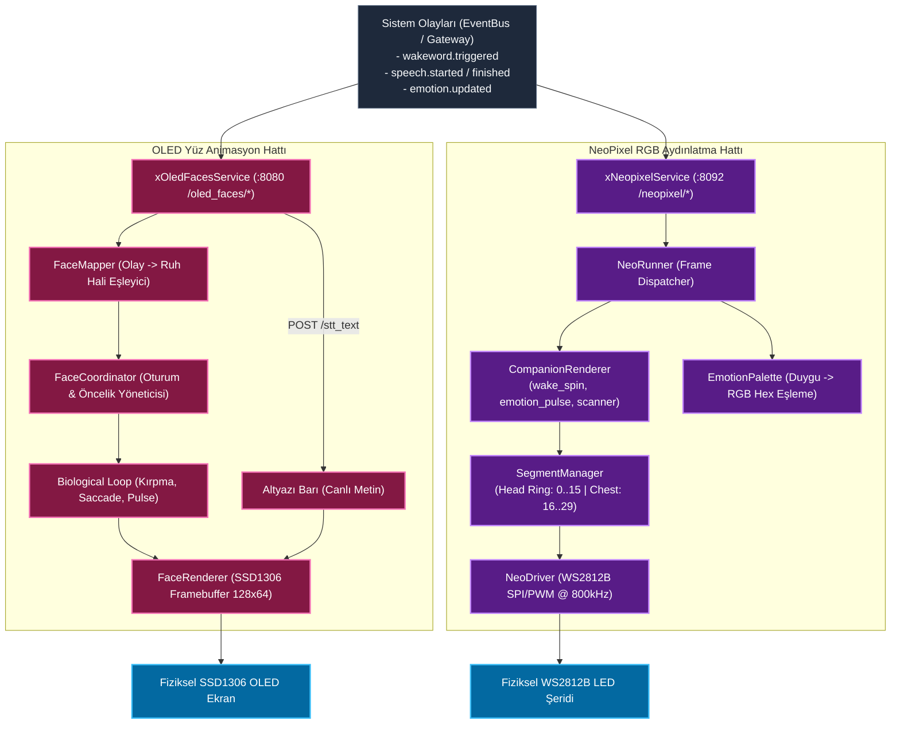
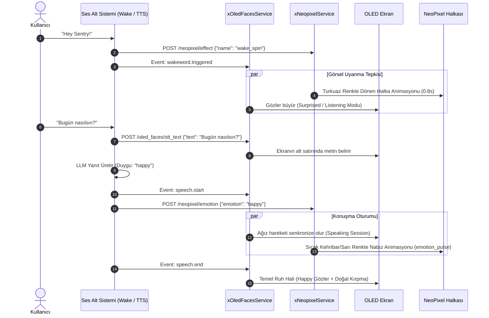

# Görsel Çıktı Modülü Mimari ve Teknik Dokümantasyonu (Visual Output Subsystem)

> **Modül:** `modules/visual_output`  
> **Kapsam:** `modules/visual_output/oled_faces`, `modules/visual_output/neopixel`  
> **Tasarım Deseni:** Coordinator Pattern, Hardware Driver Abstraction (SSD1306 / WS2812B), Segment Isolation, Biological Animation Loop  
> **İlgili Portlar:** Gateway altından yönlendirilir veya bağımsız `:8092` (NeoPixel REST)  
> **Desteklenen Donanım:** 0.96" / 1.3" I2C/SPI SSD1306 OLED Ekran & WS2812B RGB NeoPixel LED Şeridi (Ring + Chest)

---

## 1. Genel Bakış ve Modül Sorumlulukları

`modules/visual_output`, SentryBOT V5'in duygusal durumunu, canlılık hissini, sistem durumunu ve kullanıcı etkileşimlerini dış dünyaya yansıtan görsel ifade alt sistemidir. İki ana donanım ve yazılım bileşeninden meydana gelir:

1. **`oled_faces` (OLED Yüz İfadeleri ve Göz Animasyonları):**
   - Robotun başındaki SSD1306 OLED ekranda doğal göz animasyonları (`neutral`, `happy`, `sad`, `angry`, `curious`, `surprised`, `focused`) çizer.
   - İnsan benzeri biyolojik davranışları simüle eder: rastgele göz kırpma (Poisson aralıklı jitter), nefes alma göz büyümesi ve ortamdaki sese/yüze doğru göz kaydırma (saccade).
   - Konuşma esnasında ağız hareketi (`speaking`), düşünme esnasında dönen göz/bakış (`thinking`), dinleme esnasında odaklanmış göz (`listening`) oturumlarını koordine eder.
   - Konuşulan veya tanınan STT metnini ekranın alt kısmında canlı altyazı olarak yansıtır (`set_stt_text`).
2. **`neopixel` (RGB LED Halka ve Gövde Aydınlatması):**
   - Robotun baş çevresindeki 16'lı LED halkasını ve göğsündeki durum LED'lerini sürer.
   - Uyandırma kelimesi tespit edildiğinde turkuaz renkte dönen uyanma halkası (`wake_spin`), robotun duygu durumuna göre nefes alıp veren renk nabzı (`emotion_pulse`), Cylon/Knight Rider göz tarayıcısı (`scanner`) ve acil durum uyarı desenlerini oynatır.
   - **Segment İzolasyonu (`SegmentManager`):** Baş halkasındaki bir animasyon (örn. `wake_spin`), göğüs veya durum LED'lerinin bağımsız çalışmasını bozmaz.

---

## 2. Mimari ve Veri Akış Diyagramları

### 2.1 Görsel Koordinasyon ve Çizim Boru Hattı (Mermaid Flowchart)



---

### 2.2 Uyanma ve Konuşma Sırasında Görsel Tepki (Mermaid Sequence)



---

## 3. Sınıf, Fonksiyon ve Metot Seviyesi Teknik Referans

### 3.1 `modules/visual_output/oled_faces`

#### `xOledFacesService` (`xOledFacesService.py`)
- `start() -> None`: OLED ekranını başlatır (`display.begin()`), önyükleme logosunu çizer ve `oled-faces` arka plan çizim iş parçacığını (`_thread`) koşturur.
- `stop() -> None`: Döngüyü güvenle durdurur ve ekranı karartır (`display.close()`).
- `on_interaction_event(event_type: str, data: Optional[Dict[str, Any]] = None) -> None`:
  - Gateway'den veya ses modülünden gelen olayları (`speech.start`, `speech.end`, `wakeword.triggered`) karşılar.
  - STT metinlerini altyazı motoruna aktarır (`set_stt_text`).
  - `FaceCoordinator.on_event` ile mevcut görsel duruma karar verir.
- `status() -> Dict[str, Any]`: Ekran bağlantı durumu, aktif oturumlar ve yüklü bitmap kataloglarını döner.

#### `FaceCoordinator` (`services/face_coordinator.py`)
- **Temel Ruh Halleri (Baseline Moods):**
  - `neutral` (Durgun/doğal gözler), `happy` (Yukarı kıvrık gözler), `sad` (Aşağı eğimli gözler), `angry` (Çatık kaşlı gözler), `curious` (Biri büyük biri küçük gözler), `surprised` (Geniş açık yuvarlak gözler), `focused` (Daralmış keskin gözler).
- **Etkileşim Oturumları (Interaction Sessions):**
  - `speak_session_active()`: Robot konuşurken geçici duygusal olayların ağız senkronizasyonunu kesmesini önler.
  - `listen_session_active()`: Robot dinleme modundayken gözlerin çevreye bakınmasını (idle wander) kilitler ve kullanıcıya odaklanır.
- **Duygu Debounce:** Art arda gelen hızlı duygu değişimlerini filtreleyerek ekran titremesini önler.

#### `FaceRenderer` (`services/face_renderer.py`)
- SSD1306 donanımını (128x64 veya 128x32) yönetir. Donanım yoksa başsız (headless) bellek tamponunda çalışır.
- `set_stt_text(text: str, duration_s: float = 4.5) -> None`: Ekranın alt satırında 4.5 saniye boyunca transkript metnini kaydırarak gösterir.

---

### 3.2 `modules/visual_output/neopixel`

#### `xNeopixelService` & `NeoRunner` (`services/runner.py`)
- WS2812B LED şeridini asenkron olarak günceller.
- `NeoDriverConfig`:
  - `device: str = "/dev/spidev0.0"`: SPI arabirimi.
  - `num_leds: int = 30`: Toplam LED adedi (16 adet baş halkası + 14 adet göğüs).
  - `speed_khz: int = 800`: Standart WS2812B frekansı.
  - `backend: str = "auto"`: Raspberry Pi üzerinde donanımsal SPI/PWM, test ortamında bellek tabanlı `sim_strip`.

#### `CompanionRenderer` (`services/companion_renderer.py`)
Önceden tanımlanmış yoldaş robot animasyonları:
- `wake_spin`: Uyanma anında baş halkasında dönen turkuaz LED ışığı. Animasyon bitene kadar harici mod değişikliklerini kuyrukta erteler.
- `emotion_pulse`: Robotun o anki duygusal paletine (`EmotionPalette`) uygun renkte sinüzoidal parlaklık nefes alması.
- `scanner`: Cylon / Knight Rider tarzı sağa sola kayan kırmızı LED ışığı.
- `rainbow`: Gökkuşağı renk geçişi.

#### `SegmentManager` (`services/segments.py`)
LED şeridini mantıksal bölgelere ayırır:
```yaml
segments:
  - name: "head_ring"
    start: 0
    count: 16
  - name: "chest"
    start: 16
    count: 14
```
- **İzolasyon Kuralı:** `head_ring` üzerinde çalışan bir animasyon, `chest` segmentine uygulanan sabit renk veya nabız efektini etkilemez.

#### `EmotionPalette` (`emotions/palette.py`)
SentryBOT standart duygu isimlerini RGB renk kodlarına çevirir:
- `happy` $\rightarrow$ Kehribar Sarısı `[255, 180, 0]`
- `calm` / `neutral` $\rightarrow$ Yumuşak Camgöbeği `[0, 180, 220]`
- `angry` / `alarm` $\rightarrow$ Parlak Kırmızı `[255, 0, 0]`
- `curious` $\rightarrow$ Mor `[180, 0, 255]`
- `sad` $\rightarrow$ Koyu Mavi `[0, 40, 180]`

---

## 4. REST API Endpoint Tablosu

### 4.1 OLED Faces Uç Noktaları (`/oled_faces/*`)

| Metot | Uç Nokta | Açıklama | Örnek Gövde |
|---|---|---|---|
| `POST` | `/oled_faces/emotion` | Temel yüz ifadesini değiştirir | `{"emotion": "happy", "duration_s": 3.0}` |
| `POST` | `/oled_faces/gaze` | Göz bakış açısını yönlendirir | `{"direction": "look_left"}` |
| `POST` | `/oled_faces/stt_text` | Ekran altına altyazı yansıtır | `{"text": "Merhaba dünya", "duration_s": 5.0}` |
| `GET` | `/oled_faces/status` | Ekran durumu ve aktif oturumları döner | Yanıt: `{"ok": true, "has_display": true, ...}` |
| `POST` | `/oled_faces/event` | Etkileşim olayı enjekte eder | `{"type": "speech.start"}` |

### 4.2 NeoPixel Uç Noktaları (`:8092` - `/neopixel/*`)

| Metot | Uç Nokta | Açıklama | Örnek Gövde |
|---|---|---|---|
| `POST` | `/neopixel/emotion` | Duyguya göre RGB rengi ve nabzı ayarlar | `{"emotion": "happy"}` |
| `POST` | `/neopixel/effect` | Özel bir ışık efekti çalıştırır | `{"name": "wake_spin", "segment": "head_ring"}` |
| `POST` | `/neopixel/color` | Tüm veya belirli bir segmente statik renk basar | `{"r": 0, "g": 255, "b": 128, "segment": "chest"}` |
| `GET` | `/neopixel/status` | LED şeridi ve segment durumunu döner | Yanıt: `{"ok": true, "num_leds": 30, ...}` |
| `POST` | `/neopixel/clear` | Tüm LED'leri söndürür | Yanıt: `{"ok": true}` |

---

## 5. Konfigürasyon Referansı (`agent.yaml` ve `config.yml`)

```yaml
visual_output:
  # OLED Yüz Yapılandırması
  oled_faces:
    enabled: true
    display:
      driver: "ssd1306"
      port: 1                    # I2C Port 1
      address: "0x3C"            # Standart SSD1306 adresi
      width: 128
      height: 64
      brightness: 255
    biological:
      blinking_enabled: true
      min_blink_interval_s: 2.5
      max_blink_interval_s: 6.0
      saccade_enabled: true

  # NeoPixel RGB Yapılandırması
  neopixel:
    enabled: true
    hardware:
      device: "/dev/spidev0.0"
      num_leds: 30
      speed_khz: 800
      backend: "auto"            # "auto", "rpi_ws281x" veya test için "sim"
      segments:
        - name: "head_ring"
          start: 0
          count: 16
        - name: "chest"
          start: 16
          count: 14
    companion:
      default_mode: "emotion_pulse"
      wake_spin_duration_s: 0.8
```
