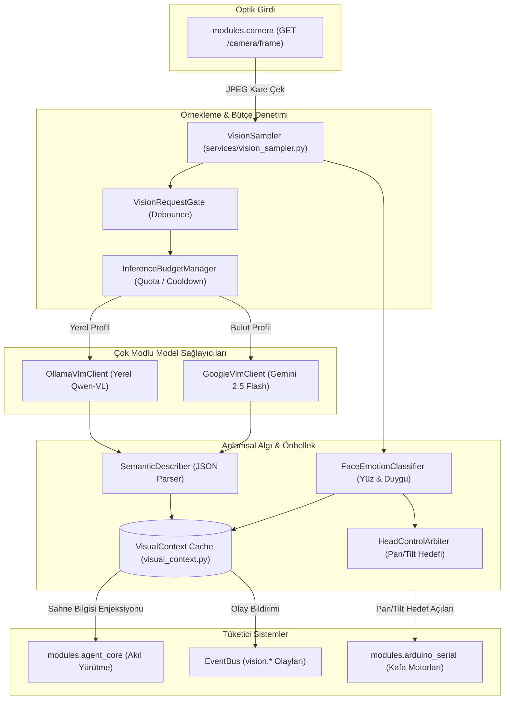
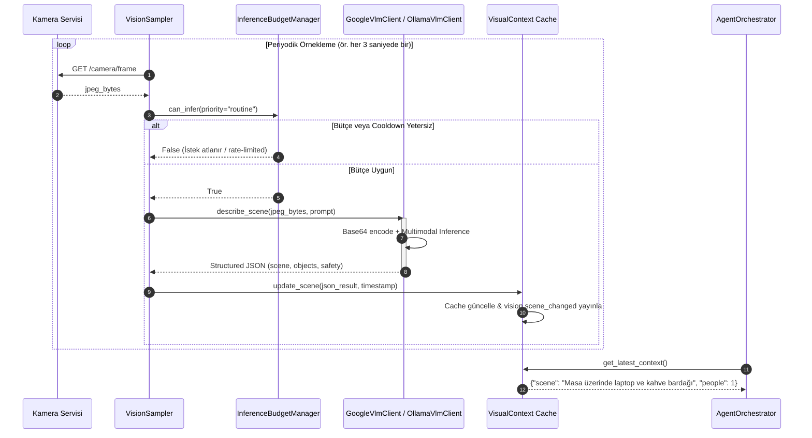

# modules.vlm_bridge — Mimari ve Teknik Dokümantasyon

> **SentryBOT V5 Görsel Dil Modeli (VLM) ve Çok Modlu Algı Köprüsü**  
> Graphviz Kaynak Dosyası: [architecture_vlm_bridge.dot](file:///c:/Users/emohi/Desktop/Project%20SentryBOT%20V5/modules/vlm_bridge/architecture_vlm_bridge.dot)  
> SVG Diyagramı: [architecture_vlm_bridge.svg](file:///c:/Users/emohi/Desktop/Project%20SentryBOT%20V5/modules/vlm_bridge/architecture_vlm_bridge.svg)

---

## 1. Genel Bakış ve Sorumluluklar

`modules.vlm_bridge`, kameradan gelen optik kareleri anlamsal sahne açıklamalarına, nesne tespitlerine, insan duygularına ve uzamsal ilişkilere dönüştüren çok modlu (multimodal) yapay zeka köprüsüdür. Hem yerel Ollama multimodal modellerini (`qwen2.5-vl`, `llama3.2-vision`) hem de bulut Google AI Studio (`gemini-2.5-flash`) servislerini destekler. Bütçe ve kota denetleyicisi (`InferenceBudgetManager`) ile donanımı aşırı ısınmadan ve kota aşımlarından korur.

### Temel Sorumluluk Alanları
1. **Görsel Örnekleme ve Kapılama (`VisionSampler`, `VisionRequestGate`):** Kameradan sürekli gelen kareleri belirli aralıklarla veya sahnede hareket/değişiklik olduğunda filtreleyerek yakalar (FPS debouncing).
2. **Çıkarım Bütçesi ve Kota Yönetimi (`InferenceBudgetManager`):** Çıkarım sıklığını, token tüketimini ve saniye başına maliyeti sınırlandırır. Raspberry Pi CPU/GPU kaynaklarının tükenmesini engeller.
3. **Çok Modlu Model İstemcileri (`OllamaVlmClient`, `GoogleVlmClient`):** Görüntüleri Base64 formatına çevirip yapılandırılmış JSON şablonları eşliğinde yerel veya uzak VLM'e iletir.
4. **Semantik Sahne Anlamlandırma (`SemanticDescriber`, `VisualContext`):** VLM'den dönen yanıtları ayrıştırır; sahne özeti, tespit edilen nesneler, yüz ifadeleri ve güven skorlarını thread-safe bir önbellek zarfında (`VisualContext`) tutar.
5. **Görsel Olay Dağıtımı (`VisionEventBus`):** Sahne belirgin şekilde değiştiğinde (`vision.scene_changed`), yeni bir insan belirdiğinde (`vision.person_spotted`) veya duygu algılandığında EventBus üzerinden sinyal yayınlar.
6. **Kafa Yönlendirme Hakemi (`HeadControlArbiter`):** Algılanan insan yüzlerine ve ilgi noktalarına robot kafasını hizalamak için pan/tilt açı komutları üretir.

---

## 2. Mimari ve Veri Akış Şemaları

### 2.1 VLM Algı Hattı Akış Şeması (Flowchart)

### 2.2 Görsel Çıkarım Döngüsü (Sequence Diagram)

---

## 3. Bileşen Detayları ve API Sözleşmeleri

### 3.1 `InferenceBudgetManager` (`services/inference_budget.py`)
- `can_infer(priority: str = "normal") -> bool`
  - Son çıkarımdan bu yana geçen süreyi (`min_interval_s`), dakikalık istek kotasını (`max_requests_per_minute`) ve günlük bütçeyi denetler.
- `record_inference(tokens_used: int = 0, latency_ms: float = 0.0) -> None`
  - Gerçekleşen çıkarımı kaydeder, ortalama yanıt süresini ve harcanan kaynak miktarını telemetriye işler.

### 3.2 `OllamaVlmClient` & `GoogleVlmClient` (`services/*_vlm_client.py`)
- `describe_frame(image_bytes: bytes, prompt: str | None = None) -> Dict[str, Any]`
  - **Parametreler:** JPEG baytları ve yönlendirici sistem promptu.
  - **Dönüş:** `{ "description": str, "objects": List[str], "confidence": float, "is_safe": bool }`
  - **İş Mantığı:** İstemci, modelden katı bir JSON yapısı talep eder; model serbest metin dönse dahi regex tabanlı kurtarıcı (`_extract_json`) ile geçerli bir sözlüğe dönüştürür.

### 3.3 `VisualContext` (`services/visual_context.py`)
- `get_latest() -> Dict[str, Any]`
  - En güncel sahne zarfını (envelope) döner.
- `update(scene_data: Dict[str, Any]) -> None`
  - Thread-safe kilit (`threading.Lock`) ile önbelleği yeniler ve zaman damgasını günceller.

### 3.4 REST API Endpointleri (`modules/vlm_bridge/api/router.py`)

| Metot | Endpoint | Açıklama | Yanıt Modeli |
|:---|:---|:---|:---|
| **`GET`** | `/vlm/healthz` | VLM köprüsü ve backend bağlantı sağlık kontrolü. | `{"ok": bool, "backend": str}` |
| **`GET`** | `/vlm/context/latest` | En son sahne açıklaması ve nesne listesi. | `{"scene": str, "objects": list, "timestamp": float}` |
| **`GET`** | `/vlm/results/latest` | Ayrıntılı model yanıtı ve ham JSON zarfı. | `{"results": dict, "latency_ms": float}` |
| **`POST`**| `/vlm/describe` | Anlık olarak bir kare yakalayıp VLM çıkarımını tetikler. | `{"success": bool, "description": str}` |
| **`POST`**| `/vlm/target/follow` | Kafa takibi için hedef koordinatları kilitler. | `{"tracking": bool, "target": str}` |

---

## 4. Hata Yönetimi ve Edge-Case Senaryoları

| Senaryo / Edge-Case | Olası Risk | Savunma Mekanizması |
|:---|:---|:---|
| **VLM Arka Ucunun Çökmesi (Ollama / Gemini Down)** | İstek sonsuza kadar askıda kalabilir. | İstemciler katı timeout sınırına (`timeout=5.0s`) sahiptir; hata anında önbellekteki son geçerli sahne bilgisi (`stale-while-revalidate`) döndürülür. |
| **Karanlık / Boş Kare (Black Frame)** | VLM anlamsız halüsinasyonlar üretebilir. | `VisionSampler`, ortalama piksel parlaklığını (`luminance`) kontrol eder; parlaklık `< 15` ise çıkarım iptal edilir. |
| **Modelin Bozuk JSON Yanıtı Dönmesi** | JSONDecodeError ile servisin durması. | `SemanticDescriber`, yapılandırılmış JSON bulamazsa metin madenciliğiyle anahtar kelimeleri ayıklar ve güvenli varsayılan şemaya yerleştirir. |
| **Aşırı Bulut Kota Tüketimi (Gemini Quota Exceeded)** | API faturalandırma riski veya HTTP 429. | `InferenceBudgetManager` yerel kotayı aştığı anda otomatik olarak yerel hafif tespit modellerine fallback yapar. |

---

## 5. Modüller Arası Giriş ve Çıkışlar

- **Girişler:**
  - `modules.camera`: `/camera/frame` üzerinden çekilen anlık JPEG görüntüleri
  - `config/agent.yaml`: VLM profil tercihleri (`runtime_profile`), model adları ve hız sınırları
- **Çıkışlar:**
  - `modules.agent_core`: Çevresel sahne bağlamı (`laya_scene_summary`, `world_context`)
  - `modules.arduino_serial`: Hedef takip koordinatları (`pan_target`, `tilt_target`)
  - `EventBus`: `vision.scene_changed`, `vision.person_spotted` olay bildirimleri
