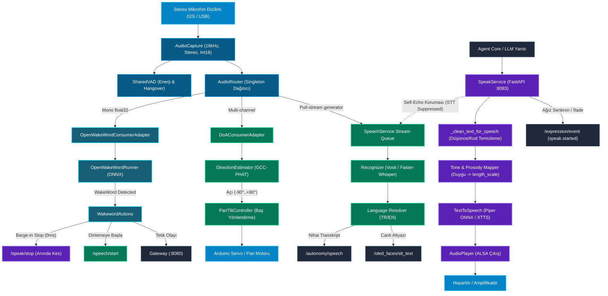
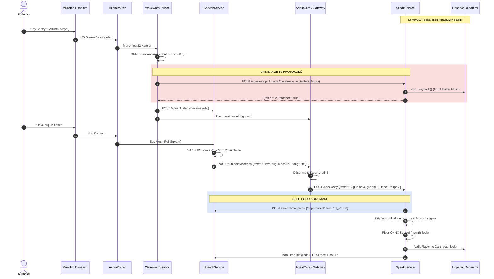

# Ses Alt Sistemi Mimari ve Teknik Dokümantasyonu (Unified Voice Architecture)

> **Modül:** `modules/voice`  
> **Kapsam:** `audio_router.py`, `modules/voice/wakeword`, `modules/voice/speech`, `modules/voice/speak`  
> **Tasarım Deseni:** Singleton Capture Multiplexer, Adapter Pattern, Split-Lock Concurrency, Non-blocking Streaming  
> **İlgili Portlar:** `8083` (Speak TTS), `8084` (Speech STT), `8085` (WakeWord)

---

## 1. Genel Bakış ve Modül Sorumlulukları

SentryBOT V5 Ses Alt Sistemi (`modules/voice`), robotun akustik dünya ile olan tüm çift yönlü (işitme ve konuşma) etkileşimini yöneten birleşik mimaridir. Linux/ALSA ortamında tek bir fiziksel ses kartına (I2S veya USB mikrofon dizilimi) birden çok alt sistemin aynı anda erişmeye çalışması durumunda ortaya çıkan **ALSA `EBUSY` kilitlenmesini ortadan kaldırmak** amacıyla merkezi bir ses yönlendirici (`AudioRouter`) üzerinde yapılandırılmıştır.

Alt sistem şu dört temel bileşenden meydana gelir:

1. **`audio_router.py` (Merkezi Yakalama ve Çoklayıcı):** Tek bir PyAudio/ALSA akışı açarak yakalanan 16 kHz stereo PCM karelerini eşzamanlı olarak WakeWord motoruna, Konuşma Tanıma (STT) motoruna ve Yön Bulma (DoA) modülüne dağıtır. Paylaşımlı Ses Aktivite Algılama (`SharedVAD`) mekanizmasını barındırır.
2. **`modules/voice/wakeword` (Uyandırma Kelimesi Dedektörü):** Sürekli ses akışını dinleyerek önceden eğitilmiş ONNX modelleriyle ("hey sentry", "sentry") düşük CPU tüketimiyle uyanma kelimesi tespit eder. Tetiklendiğinde anında **0ms Barge-In** protokolünü devreye sokar.
3. **`modules/voice/speech` (Konuşma Tanıma - STT & DoA):** Vosk veya Faster-Whisper kullanarak ses dalgalarını metne dönüştürür. Çift mikrofon kanalı arasındaki gecikmeyi (GCC-PHAT) hesaplayarak sesin geldiği açıyı (`-90°` ile `+90°`) saptar ve robotun kafasını sese doğru çevirir. Kendi konuşurken yankı yapmasını önleyen STT Bastırma Denetçisine (`STT Suppression Watchdog`) sahiptir.
4. **`modules/voice/speak` (Konuşma Sentezi - TTS & Oynatma):** Piper TTS (ONNX) ve yedek HTTP motorları (XTTS, eSpeak) ile metinleri sese dönüştürür. Düşünce/monolog temizleme filtresi (`ThoughtFilter`), duyguya göre tonlama (prosodi ayarı) ve paralel sentezleme/oynatma için **R21 Ayrık Kilit (Split-Lock)** mimarisini yürütür.

---

## 2. Mimari ve Veri Akış Diyagramları

### 2.1 Ses Dağıtımı ve Çift Yönlü İletişim Akışı (Mermaid Flowchart)



---

### 2.2 Uyanma Kelimesi -> Barge-In -> STT -> TTS Uçtan Uca Dizi Diyagramı (Mermaid Sequence)



---

## 3. Sınıf, Fonksiyon ve Metot Seviyesi Teknik Referans

### 3.1 `audio_router.py` (Merkezi Ses Dağıtıcısı)

```python
class AudioConsumer(Protocol):
    def on_audio_frame(self, frame: np.ndarray, timestamp: float) -> None: ...
    def on_start(self) -> None: ...
    def on_stop(self) -> None: ...
```

#### `AudioConfig` (Dataclass)
- `device: str = "default"`: ALSA donanım adı (`plughw:CARD=...,DEV=...`).
- `sample_rate: int = 16000`: Yakalama frekansı (Tüm modeller 16 kHz bekler).
- `channels: int = 2`: Giriş kanal sayısı (DoA gecikme hesabı için en az stereo gerekir).
- `frame_size: int = 1024`: Tampon başına düşen kare sayısı.
- `format: str = "int16"`: Örnekleme veri formatı (`int16` veya `float32`).
- `vad_enabled: bool = True`: Yerleşik paylaşımlı VAD aktifliği.
- `vad_threshold: float = 0.01`: Enerji eşiği katsayısı.

#### `SharedVAD`
- `process(frame: np.ndarray) -> bool`:
  - **İş Mantığı:** Giriş ses karesinin mutlak değer ortalamasını (`mean(abs(frame))`) hesaplar. Eşik değer aşıldığında `_is_speaking = True` yapar ve son ses zamanını (`_last_voice_time`) günceller.
  - **Hangover (Sönümleme):** Ses kesildikten sonra 500 ms boyunca `_is_speaking` durumunu `True` tutarak kelime arası duraklamalarda STT kesintilerini önler.

#### `AudioCapture`
- `register_consumer(name: str, consumer: AudioConsumer, callback: Optional[Callable] = None) -> None`: Yeni dinleyici ekler.
- `unregister_consumer(name: str) -> bool`: Dinleyiciyi çıkarır.
- `start() -> bool`: PyAudio nesnesini başlatır, hedef cihazı bulur (`_find_device`) ve arka planda kartsız çalışma kilitlenmesini engelleyen portaudio geri çağırımını (`_audio_callback`) çalıştırır.
- `stop() -> None`: Yakalamayı durdurur ve kayıtlı tüm tüketicilere `consumer.on_stop()` sinyali gönderir.
- `stream(maxsize: int = 64) -> Generator[bytes, None, None]`:
  - **Kuyruk Tipi:** Pull-style sınırlı kuyruk (`queue.Queue(maxsize=64)`).
  - **Taşma Politikası (Drop-Oldest):** Kuyruk dolduğunda eski karesi düşürülür (`chunk_q.get_nowait()`), yeni gelen veri yazılır. Bu sayede tüketiciler her zaman en güncel (gecikmesiz) sesi alır.

#### `AudioRouter` (Singleton)
- `get_audio_router(config: Optional[AudioRouterConfig] = None) -> AudioRouter`: Global singleton örneğini döner. `agent.yaml` içerisindeki `audio_router:` bloğunu otomatik yükler.

---

### 3.2 `modules/voice/wakeword` (Uyandırma Kelimesi)

#### `WakewordService` (`xWakewordService.py`)
- `start() -> None`: `AudioRouter` üzerinden yakalama akışını (`capture.stream()`) alır. `OpenWakewordRunner` motorunu sürekli iterasyonda koşturur.
- `stop() -> None`: Dinlemeyi sonlandırır.
- `_on_wakeword(label: str) -> None`:
  - **Debounce:** İki tetiklenme arasında en az 2.0 saniye geçmesi şartı aranır.
  - **Eylemler:** `WakewordActions.trigger()` çağrılır:
    1. `/speak/stop` adresine POST atarak robotun konuşmasını anında susturur.
    2. `/agent/speech/interrupt` ile Agent Core durum makinesini temizler.
    3. `/speech/start` ile STT dinleme oturumu açar.
    4. Varsa uyanma ses efektini çalar.

#### `OpenWakewordRunner` (`services/openwakeword_runner.py`)
- ONNX modellerini (`hey_sentry`, `sentry`) yükler.
- Her 1280 örnekte bir 16 kHz mono veriyi ONNX grafiğine besler.
- Çıktı skoru `threshold` (varsayılan 0.50) üzerine çıktığında uyanma etiketini yield eder.

---

### 3.3 `modules/voice/speech` (STT & Yön Tespiti)

#### `SpeechService` (`xSpeechService.py`)
- `start_listening() -> None`: `AudioRouter` akışını tüketmeye başlar.
- `stop_listening() -> None`: Dinlemeyi durdurur.
- `set_stt_suppressed(suppressed: bool, ttl_s: float = 15.0) -> None`:
  - **Self-Echo Koruması:** Robot kendisi konuştuğunda STT motorunun robotun kendi sesini kullanıcı komutu zannetmesini önlemek için STT'yi askıya alır. `ttl_s` süresi sonunda otomatik zaman aşımı ile kilitlenmeyi çözer.
- `process_audio_chunk(pcm_bytes: bytes) -> Optional[RecognitionResult]`: Gelen ses bloğunu tanıma motoruna iletir.

#### `Recognizer` (`services/recognizer.py`)
- Vosk ve Faster-Whisper modelleriyle çift yönlü çözümleme desteği sunar.
- **Dual-Decode Ambiguity Check:** Birincil modelin güven skoru belirlenen marjinin altındaysa (`dual_decode_margin: 0.6`), ikinci bir dil/model üzerinden doğrulanır (`resolve_stt_text_and_language`).

#### `DirectionEstimator` (`services/direction.py`)
- **Algoritma:** GCC-PHAT (Generalized Cross-Correlation with Phase Transform).
- **Giriş:** Stereo 2 kanal 16 kHz PCM verisi.
- **Parametreler:** Mikrofonlar arası mesafe (`mic_distance_m: 0.06`), ses hızı (`sound_speed: 343.0 m/s`).
- **Çıktı:** Ses kaynağının açısı: `-90°` (sol), `0°` (tam karşı), `+90°` (sağ).
- `PanTiltController` bu açıyı yumuşatarak baş motorlarına servo açısı olarak iletir.

---

### 3.4 `modules/voice/speak` (TTS & Oynatma)

#### `SpeakService` (`xSpeakService.py`)
- `speak(text: str, engine: Optional[str] = None, tone: Optional[str | dict] = None, speaker_wav: Optional[str] = None, language: Optional[str] = None, trace_id: Optional[str] = None) -> Dict[str, Any]`:
  - Metni temizler (`_clean_text_for_speech`).
  - Ton parametresini Piper prosodi parametrelerine çevirir (`_tone_to_piper`).
  - **R21 Split-Lock:** Sentezleme işlemi `_synth_lock` altında, hoparlörden çalma ise `_play_lock` altında yürütülür. Böylece 1. cümle hoparlörden çalarken 2. cümle arka planda paralel sentezlenir.
- `stop_speaking() -> Dict[str, Any]`:
  - Anında `cancel_synthesis()` bayrağını kaldırarak devam eden Piper çıkarımını keser.
  - `player.stop_playback()` ile ses kartı çıkışını susturur.
  - `speak.finished (interrupted=True)` ifadesini yayımlar.
- `_clean_text_for_speech(text: str) -> str`:
  - ```` ```code``` ```` bloklarını, backtick'leri ve markdown yıldızlarını temizler.
  - LLM modellerinin (Qwen, DeepSeek vb.) iç ses/düşünce bloklarını (`[düşünce: ...]`, `analysis:`, `reasoning:`, `thinking:`) sese dönüştürülmeden filtreler.

#### `TextToSpeech` (`services/tts.py`)
- **Piper TTS:** Yerel ONNX tabanlı, GPU gerektirmeyen düşük gecikmeli (<120 ms) sentez motoru.
- **GLaDOS & Türkçe Modelleri:** `tr_TR-dfki-medium` ve özel eğitilmiş GLaDOS modelleri.
- **Geri Çekilme (Fallback):** Model eksikse veya hata verirse sırasıyla XTTS HTTP servisine, eSpeak motoruna veya test ortamında `DummyBackend`'e geçer.

---

## 4. REST API Endpoint Tablosu

### 4.1 Speak Servisi (`:8083`)

| Metot | Uç Nokta | Açıklama | İstek / Yanıt |
|---|---|---|---|
| `POST` | `/speak/say` | Metni doğrudan sentezleyip hoparlörden çalar | `{"text": "Merhaba", "tone": "happy"}` |
| `POST` | `/speak/say_stream` | Uzun metinleri cümlelere bölüp arka planda kuyruğa alır | `{"text": "...", "max_chunk_chars": 180}` |
| `POST` | `/speak/stop` | Devam eden sentezi ve oynatmayı 0 ms'de keser | Yanıt: `{"ok": true, "stopped": true}` |
| `GET` | `/speak/status` | TTS motorunun sağlık durumu ve meşguliyetini bildirir | `{"ready": true, "is_speaking": false}` |
| `POST` | `/speak/play` | Ham Base64 WAV ses verisini çalar | `{"data": "<base64_wav>"}` |
| `GET` | `/speak/jobs/{job_id}` | Asenkron akış görevinin durumunu sorgular | `{"status": "running", "done_chunks": 1}` |

### 4.2 Speech Servisi (`:8084`)

| Metot | Uç Nokta | Açıklama | İstek / Yanıt |
|---|---|---|---|
| `POST` | `/speech/start` | Ses tanımayı ve dinleme döngüsünü başlatır | Yanıt: `{"ok": true, "listening": true}` |
| `POST` | `/speech/stop` | Dinlemeyi durdurur | Yanıt: `{"ok": true, "listening": false}` |
| `GET` | `/speech/status` | Dinleme durumu ve ses seviyesini bildirir | `{"listening": true, "audio_level": 0.42}` |
| `POST` | `/speech/recognize` | Gönderilen ses karesini doğrudan tanır | Ham WAV/PCM verisi |
| `GET` | `/speech/direction` | Son hesaplanan ses geliş açısını döner | `{"angle_deg": 35.2, "confidence": 0.88}` |
| `POST` | `/speech/suppress` | Robot konuşurken STT'yi geçici olarak susturur | `{"suppressed": true, "ttl_s": 5.0}` |

### 4.3 Wakeword Servisi (`:8085`)

| Metot | Uç Nokta | Açıklama | İstek / Yanıt |
|---|---|---|---|
| `GET` | `/wakeword/status` | Uyandırma motorunun durumunu döner | `{"listening": true, "engine": "openwakeword"}` |
| `POST` | `/wakeword/start` | Dinleme döngüsünü başlatır | Yanıt: `{"ok": true}` |
| `POST` | `/wakeword/stop` | Dinleme döngüsünü durdurur | Yanıt: `{"ok": true}` |
| `POST` | `/wakeword/trigger` | Test amaçlı sahte uyanma tetikler | `{"word": "hey sentry"}` |

---

## 5. Konfigürasyon Referansı (`agent.yaml` ve `config.yml`)

```yaml
# Ortak Ses Donanımı ve Yönlendirici Ayarları
audio_router:
  capture:
    device: "default"         # ALSA ses giriş aygıtı (örn: plughw:CARD=ArrayUAC10,DEV=0)
    sample_rate: 16000        # 16000 Hz zorunlu
    channels: 2               # DoA için stereo zorunlu
    frame_size: 1024
    format: "int16"
    vad_enabled: true
    vad_threshold: 0.01

# Uyandırma Ayarları
wakeword:
  enabled: true
  engine: "openwakeword"
  words: ["hey sentry", "sentry"]
  threshold: 0.50
  debounce_sec: 2.0

# Konuşma Tanıma (STT) Ayarları
speech:
  recognition:
    engine: "faster-whisper"  # veya "vosk"
    model_size: "base"
    language: "tr"
    auto_language: true
    dual_decode_margin: 0.60
    input_gain: 1.0
  direction:
    enabled: true
    mic_distance_m: 0.06      # Mikrofonlar arası fiziksel mesafe (metre)
    sound_speed: 343.0

# Konuşma Sentezi (TTS) Ayarları
speak:
  tts:
    engine: "piper"
    language: "tr"
    voice: "tr_TR-dfki-medium"
    rate: 170
    volume: 0.90
    stream_max_chunk_chars: 180
  audio_out:
    device: "default"
  liveliness:
    enabled: true
    expression_base_url: "http://127.0.0.1:8080/expression"
```
